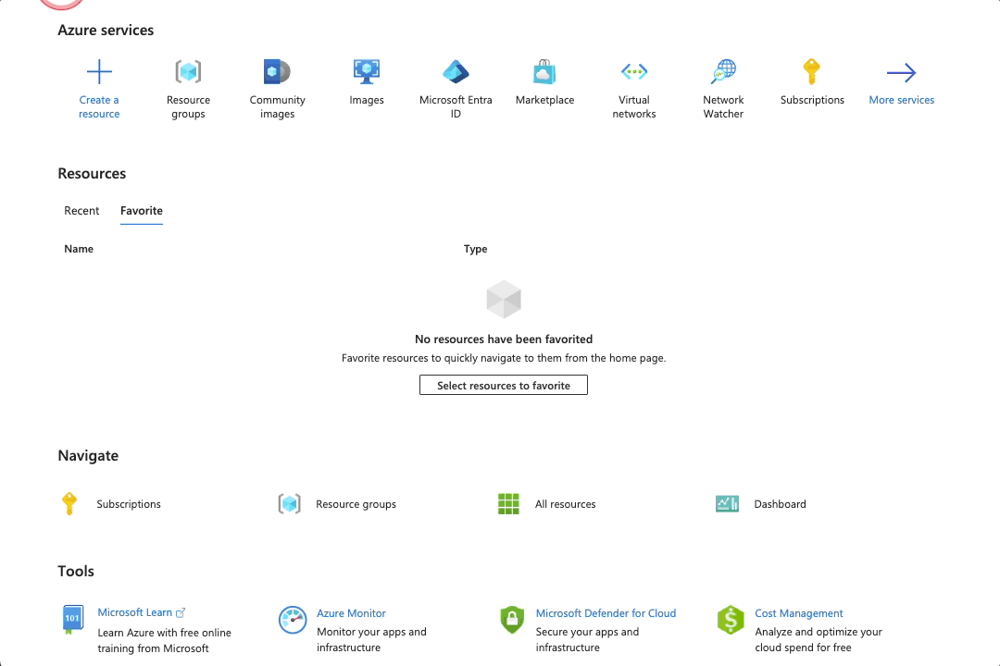
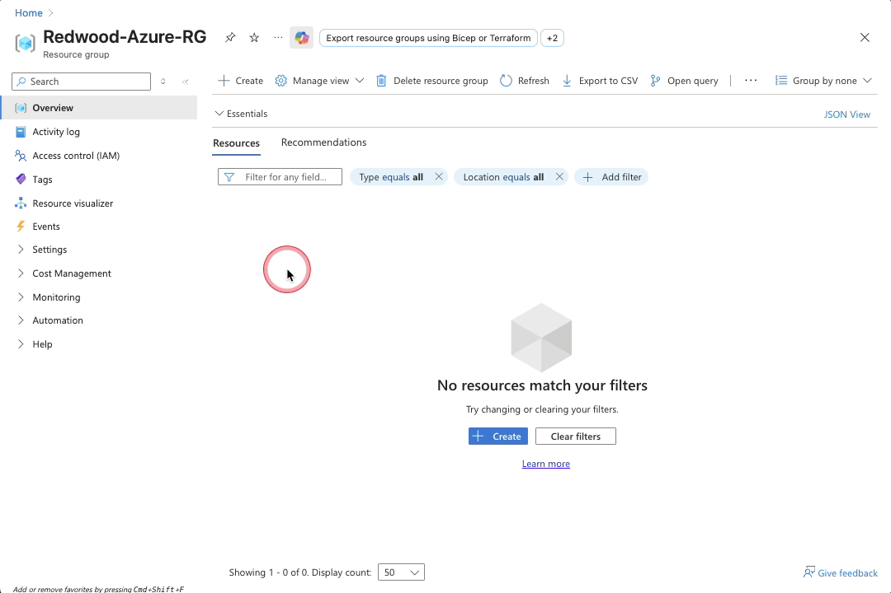
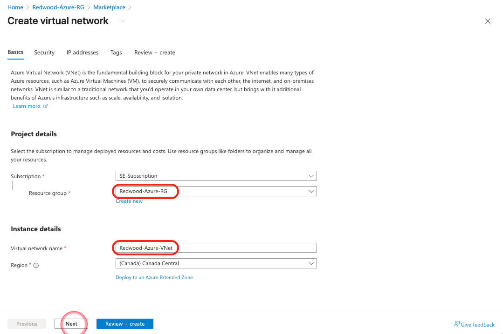
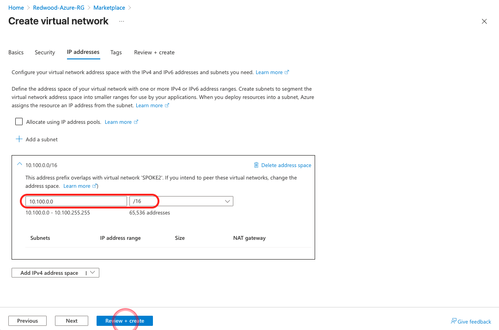
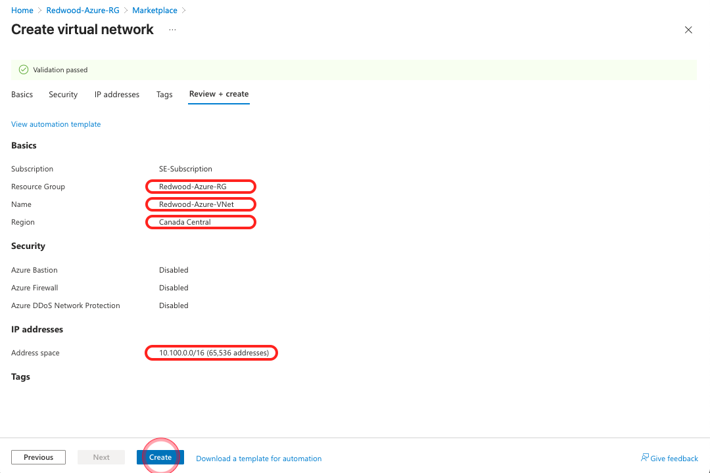
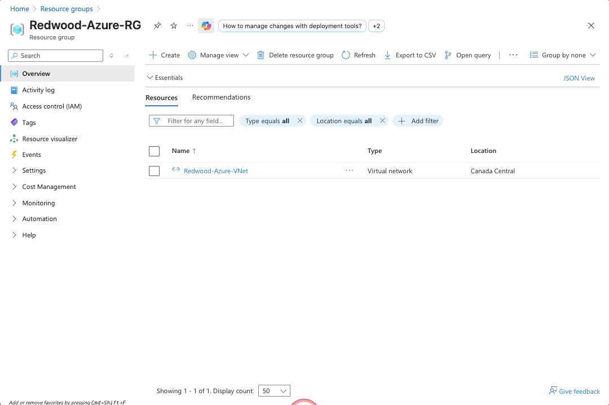
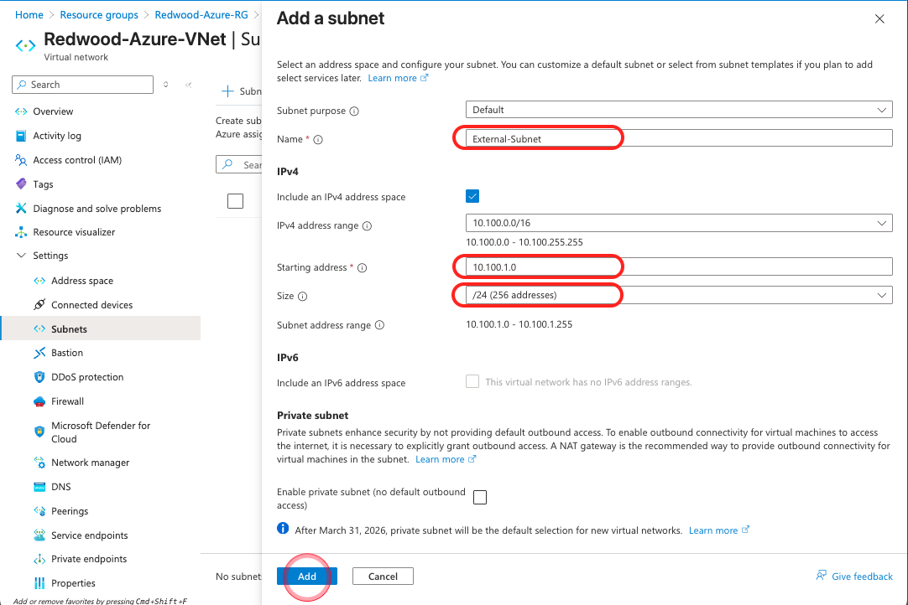
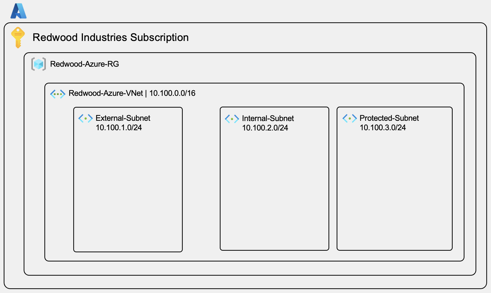
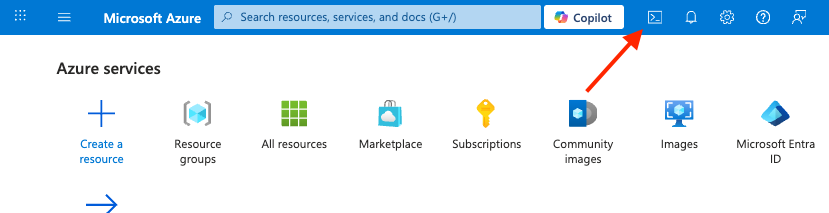

# AZ-101 Lab 1: Azure Infrastructure Foundation

## Lab Overview

**Duration:** 30 minutes  
**Difficulty:** Beginner  
**Prerequisites:** Azure subscription with Contributor access

### Objective

Create the Azure networking foundation before deploying FortiGate. This "infrastructure-first" approach mirrors enterprise deployment patterns and provides a clean foundation for security appliances. In this lab, you'll build just the VNet and subnets - routing will be configured in Lab 2 after FortiGate is deployed.

### What You'll Build

By the end of this lab, you will have:

- ✅ Resource Group in Canada Central region
- ✅ Virtual Network (VNet) with 10.100.0.0/16 address space
- ✅ Three subnets (External, Internal, Protected)

### Architecture

```text
Redwood-Azure-VNet (10.100.0.0/16)
├── External-Subnet (10.100.1.0/24)
├── Internal-Subnet (10.100.2.0/24)
└── Protected-Subnet (10.100.3.0/24)
```

### Business Context: Redwood Industries

**Company Profile:**

- 200-employee manufacturing company
- Existing FortiGate infrastructure at headquarters
- Expanding to Azure for business applications
- Needs consistent security across hybrid environment

**Today's Scenario:**
Your network team is preparing Azure infrastructure for the first cloud workloads. The security team requires that all traffic be inspected by FortiGate, maintaining the same security posture as on-premises.

---

## Step 1: Create Resource Group (5 minutes)

A Resource Group is a logical container for Azure resources. All resources for Redwood Industries will be organized in one Resource Group for easy management and cleanup.

> [!NOTE]
> Do not block the pop-ups in your browser for the Azure portal!

1. **Log in to Azure Portal:**
   - Navigate to <https://portal.azure.com>
   - Sign in with your Azure account credentials

2. **Navigate to Resource Groups:**
   - Click **Resource groups** in the left navigation menu
   - Or search for "Resource groups" in the top search bar

3. **Create New Resource Group:**
   - Click **+ Create** button at the top of the page

4. **Configure Resource Group:**
   - **Subscription:** Select your Azure subscription from dropdown
   - **Resource group:** Enter `Redwood-Azure-RG`
   - **Region:** Select **Canada Central** from dropdown
     - ⚠️ **Important:** We will be using the "Canada Central" region for this workshop

5. **Review and Create:**
   - Click **Review + create** button at bottom
   - Review the settings
   - Click **Create** button



### Validation

- ✅ Resource group appears in the list with name "Redwood-Azure-RG"
- ✅ Region shows "Canada Central"
- ✅ Status shows "Succeeded" (may take 3-5 seconds)

### Troubleshooting

| Issue | Solution |
|-------|----------|
| "Create" button is grayed out | Verify all required fields are filled and region is selected |
| "Access denied" error | Ensure you have Contributor role on the subscription |
| Can't find Canada Central | Your subscription may not have access to this region; contact admin |

---

## Step 2: Create Virtual Network (VNet) (10 minutes)

The Virtual Network provides the private IP address space for all Azure resources. Think of it as your datacenter network in the cloud.

1. **Create New Virtual Network:**
   - Click **+ Create** button at the resource group

2. **Navigate to Virtual Networks:**
   - In Azure Portal top search bar, type **virtual network** and press enter
   - Click **Create > Virtual network** in the **Virtual network** tile

   

3. **Basics Tab:**
   - **Subscription:** Select your Azure subscription
   - **Resource group:** Select **Redwood-Azure-RG** (the one you just created)
   - **Name:** Enter `Redwood-Azure-VNet`
   - **Region:** Select **Canada Central**
     - ⚠️ **Critical:** Must match Resource Group region
   - Click **Next** button

   

4. **Security Tab:**
   - Do not change anything. No options to be selected here.
   - Click **Next** button

5. **IP Addresses Tab:**
   - **IPv4 address space:**
     - You'll see a default address space (likely 10.0.0.0/16)
     - Modify the address space to `10.100.0.0/16` in the network field

   - **Subnets:**
     - ⚠️ **Do NOT add subnets here** - we'll create them separately in the next steps for better control
     - If you see a default subnet, click the trash icon to delete it
   - Click **Review + create** button

   

6. **Review and Create:**
   - Review configuration summary
   - Verify:
     - Resource group: Redwood-Azure-RG
     - Name: Redwood-Azure-VNet
     - Region: Canada Central
     - Address space: 10.100.0.0/16
     - No subnets listed
   - Click **Create** button

   

7. **Wait for Deployment:**
   - Deployment typically takes 5-10 seconds
   - You'll see "Your deployment is complete" message
   - Click **Go to resource**

### Validation

- ✅ VNet appears in the Redwood-Azure-RG resources list
- ✅ Address space shows "10.100.0.0/16"
- ✅ Region shows "Canada Central"
- ✅ No subnets are listed yet

### Understanding the Address Space

**Why 10.100.0.0/16?**

- Provides 65,536 IP addresses (10.100.0.0 through 10.100.255.255)
- Avoids overlap with Redwood's on-premises network (192.168.0.0/22)
- Follows RFC 1918 private addressing standard
- Leaves room for growth and future VNets (could use 10.101.0.0/16, 10.102.0.0/16, etc.)

**CIDR Notation:**

- /16 = 65,536 IPs
- /24 = 256 IPs (what we'll use for subnets)
- /26 = 64 IPs (common for smaller subnets)

### Troubleshooting

| Issue | Solution |
|-------|----------|
| Address space is invalid | Verify format: 10.100.0.0/16 (no spaces, correct slash) |
| Deployment fails | Check for overlapping VNets in the region |
| Can't delete default subnet | Make sure you're on IP Addresses tab during creation |

---

## Step 3: Create External Subnet (5 minutes)

The External subnet will host FortiGate's port1 interface, which connects to the internet and provides management access.

1. **Navigate to Your VNet:**
   - In **Redwood-Azure-RG** resource group, search for **Redwood-Azure-VNet** vnet
   - Click on the VNet name to open it

2. **Open Subnets Configuration:**
   - In the left menu under **Settings**, click **Subnets**
   - You should see an empty subnets list

3. **Create External Subnet:**
   - Click **+ Subnet** button at top

   

4. **Configure Subnet:**
   - **Name:** Enter `External-Subnet`
   - **Subnet address range:** Enter `10.100.1.0/24`
     - This provides 256 IPs (10.100.1.0 through 10.100.1.255)
     - ⚠️ Azure reserves 5 IPs: .0, .1, .2, .3, .255 (251 usable IPs)
   - **NAT Gateway:** Leave as **None**
   - **Network security group:** Leave as **None** (we'll create later if needed)
   - **Route table:** Leave as **None**
   - **Service endpoints:** Leave unchecked
   - **Subnet delegation:** Leave as **None**
   - Leave all other settings as default

   

5. **Add Subnet:**
   - Click **Add** button at bottom

6. **Wait for Creation:**
   - Subnet creation takes 5-10 seconds
   - You'll see the subnet appear in the list

   

### Validation

- ✅ External-Subnet appears in subnets list
- ✅ Address prefix shows "10.100.1.0/24"
- ✅ Available IPs shows 251

### Azure Reserved IPs Explained

Azure reserves 5 IPs in every subnet:

- **10.100.1.0:** Network address (standard networking)
- **10.100.1.1:** Default gateway (Azure's virtual router)
- **10.100.1.2 & 10.100.1.3:** Reserved for Azure DNS
- **10.100.1.255:** Broadcast address (standard networking)

**Usable IPs:** 10.100.1.4 through 10.100.1.254 (251 addresses)

---

## Step 4: Create Internal Subnet (5 minutes)

The Internal subnet (also called Transit subnet) will host FortiGate's port2 interface, which performs all traffic inspection.

1. **Still in Subnets View:**
   - You should still be in **Redwood-Azure-VNet > Settings > Subnets**
   - If not, navigate back to it

2. **Create Internal Subnet:**
   - Click **+ Subnet** button

3. **Configure Subnet:**
   - **Name:** Enter `Internal-Subnet`
   - **Subnet address range:** Enter `10.100.2.0/24`
   - Leave all other settings as default (None for NSG, Route table, etc.)

4. **Add Subnet:**
   - Click **Add** button

### Validation

- ✅ Internal-Subnet appears in subnets list
- ✅ Address prefix shows "10.100.2.0/24"
- ✅ Two subnets now visible (External-Subnet and Internal-Subnet)

### Why Internal Subnet is Critical

**Purpose:**

- FortiGate's port2 will be placed here (at 10.100.2.4)
- This becomes the "next-hop" for all inspected traffic
- Acts as transit zone between external threats and protected workloads

**Traffic Flow:**

```text
Protected Workload → port2 (inspect) → port1 → Internet
Internet → port1 (inspect) → port2  → Protected Workload
```

---

## Step 5: Create Protected Subnet (5 minutes)

The Protected subnet hosts your application workloads and VMs that require FortiGate security inspection.

1. **Still in Subnets View:**
   - You should still be in **Redwood-Azure-VNet > Settings > Subnets**

2. **Create Protected Subnet:**
   - Click **+ Subnet** button

3. **Configure Subnet:**
   - **Name:** Enter `Protected-Subnet`
   - **Subnet address range:** Enter `10.100.3.0/24`
   - Leave all other settings as default

4. **Add Subnet:**
   - Click **Add** button

### Validation

- ✅ Protected-Subnet appears in subnets list
- ✅ Address prefix shows "10.100.3.0/24"
- ✅ Three subnets now visible (External, Internal, Protected)

### Why This Subnet Matters

**What Goes Here:**

- Application VMs (web servers, databases, etc.)
- Any workload requiring internet access
- Resources that need security inspection

**What Happens Next (Lab 2):**

- We'll configure User Defined Routes (UDRs)
- Routes will force ALL traffic from this subnet through FortiGate
- FortiGate port2 (10.100.2.4) becomes the inspection point

---

## Lab 1 Complete! 🎉

### What You've Accomplished

You have successfully built the Azure networking foundation for Redwood Industries:

✅ **Resource Group:** Redwood-Azure-RG in Canada Central  
✅ **Virtual Network:** Redwood-Azure-VNet (10.100.0.0/16)  
✅ **Three Subnets:**

- External-Subnet (10.100.1.0/24) - For FortiGate port1
- Internal-Subnet (10.100.2.0/24) - For FortiGate port2  
- Protected-Subnet (10.100.3.0/24) - For workload VMs

### Architecture Review



Resource Group: Redwood-Azure-RG
Region: Canada Central

### Key Takeaways

1. **Infrastructure-First Approach:** Building networking infrastructure before deploying security appliances mirrors enterprise workflows and makes troubleshooting easier.

2. **Three-Subnet Design:** This follows Fortinet's recommended architecture:
   - **External** = Internet-facing interface
   - **Internal/Transit** = Inspection interface
   - **Protected** = Workload subnet

3. **Address Planning:** The 10.100.0.0/16 space provides:
   - 65,536 total IPs
   - Clear separation from on-prem (192.168.x.x)
   - Room for additional subnets as needs grow

4. **No Routing Yet:** Notice we haven't configured any routing. This is intentional! In Lab 2, we'll deploy FortiGate first, then configure the routes to point to its actual IP address (10.100.2.4).

### Next Steps

Ready for **Lab 2: FortiGate VM Deployment & Traffic Steering!**

In Lab 2, you will:

- Deploy FortiGate VM from Azure Marketplace
- Configure FortiGate with BYOL licensing (FortiFlex token)
- Set port2 IP to 10.100.2.4 for traffic inspection
- Create Route Table with UDRs to force traffic through FortiGate
- Associate routes with Protected-Subnet
- Verify interface configuration

### Troubleshooting Reference

If you encountered issues during Lab 1, review this troubleshooting guide:

**Issue: Subnet creation failed.**

- Check for CIDR overlap with existing subnets
- Verify VNet has sufficient address space
- Ensure subnet address is within VNet range

**Issue: Resources in wrong region.**

- Delete and recreate in Canada Central
- All resources must be in same region for this workshop

**Still Stuck?**

- Raise your hand for instructor assistance
- Check Azure Activity Log for detailed error messages
- Verify you have Contributor role on subscription

---

## Configuration Checklist

Before moving to Lab 2, verify:

- [ ] Resource Group "Redwood-Azure-RG" exists in Canada Central
- [ ] VNet "Redwood-Azure-VNet" has address space 10.100.0.0/16
- [ ] External-Subnet exists with range 10.100.1.0/24
- [ ] Internal-Subnet exists with range 10.100.2.0/24
- [ ] Protected-Subnet exists with range 10.100.3.0/24
- [ ] All three subnets show "Available" status

### Azure CLI Verification (Optional)

For advanced users comfortable with Azure CLI:

Open the Azure CLI



```bash
# Verify Resource Group
az group show --name Redwood-Azure-RG --query location

# Verify VNet
az network vnet show \
  --resource-group Redwood-Azure-RG \
  --name Redwood-Azure-VNet \
  --query addressSpace

# Verify Subnets
az network vnet subnet list \
  --resource-group Redwood-Azure-RG \
  --vnet-name Redwood-Azure-VNet \
  --output table
```

Expected outputs should match your configuration above.

---

**End of Lab 1:**

*Estimated completion time: 30 minutes*  
*Next: Lab 2 - FortiGate VM Deployment & Traffic Steering*

---

## Additional Resources

**Azure Documentation:**

- Virtual Networks: <https://learn.microsoft.com/azure/virtual-network/>
- Subnet Planning: <https://learn.microsoft.com/azure/virtual-network/virtual-network-vnet-plan-design-arm>

**Fortinet Documentation:**

- Azure Deployment Guide: <https://docs.fortinet.com/document/fortigate-public-cloud/7.4.0/azure-administration-guide>

---

*Lab Guide Version 2.0 - November 2025*  
*Questions? Ask your instructor or refer to the main workshop materials.*
