# AZ-101 Lab 2: FortiGate VM Deployment & Traffic Steering

## Lab Overview

**Duration:** 60 minutes  
**Difficulty:** Intermediate  
**Prerequisites:** Completed Lab 1, FortiFlex token (provided by instructor)

### Objective

Deploy FortiGate VM from Azure Marketplace with BYOL licensing and configure Azure routing to force traffic through FortiGate for inspection. This lab combines the FortiGate deployment with traffic steering configuration - creating the complete foundation for security inspection.

### What You'll Build

By the end of this lab, you will have:

- ✅ FortiGate VM deployed in Azure (Standard_F2s_v2 or Standard_D2_v4)
- ✅ port1 (External) with Public IP for internet and management
- ✅ port2 (Internal) with static IP 10.100.2.4 for inspection
- ✅ Access to FortiGate web GUI
- ✅ Interfaces configured and operational
- ✅ Route Table with UDRs for traffic steering
- ✅ Route configured to force traffic through FortiGate (only the Protected subnet)

### Architecture

After Lab 2:

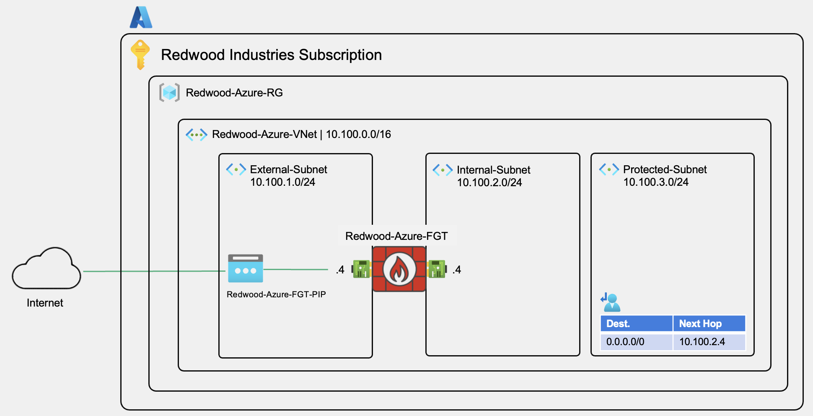

### Business Context

Redwood Industries' IT security policy requires all Azure workload traffic to be inspected by FortiGate - maintaining the same security posture as their on-premises network. In this lab, you're deploying the FortiGate VM that will become the inspection point for all traffic, then configuring Azure User-Defined Routes (UDRs) to ensure traffic flows through it.

---

## PART 1: FortiGate VM Deployment (35 minutes)

This section deploys the FortiGate virtual machine and gets it licensed and operational.

---

## Step 1: Navigate to Azure Marketplace

Azure Marketplace is where you find and deploy third-party solutions, including FortiGate.

### Instructions

1. **Create a Resource:**
   - On `Redwood-Azure-RG` resource group.
   - Click **+ Create** in the upper left corner

2. **Search for FortiGate:**
   - In the search box, type: `Fortinet FortiGate Next-Generation Firewall`
   - Press Enter or click the search icon

3. **Locate the Correct Listing:**
   - Look for listing published by **Fortinet**
   - **Important:** Multiple FortiGate listings exist
    - **Select BYOL Version:**
   - Click on **Fortinet FortiGate Next-Generation Firewall**
     - [NOTE!] NOT the **Fortinet FortiGate Next-Generation Firewall (VM)** which includes a `Starts at $0.36/3 years` note
   - Review the overview tile (optional)
   - Click **Create** button
   - Select **Single VM**

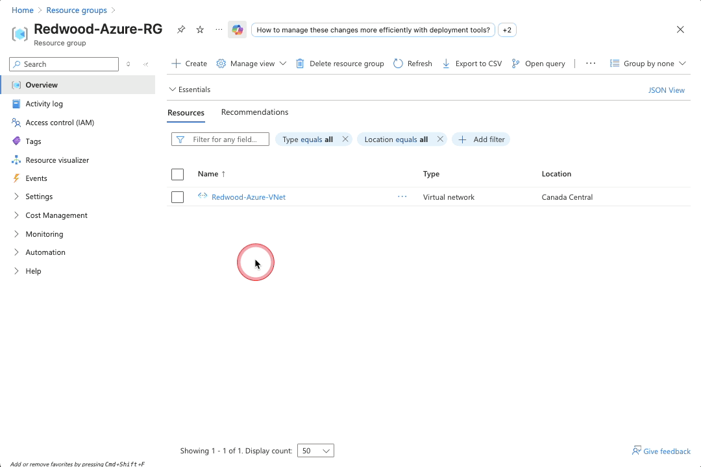

### Validation

- ✅ You're on the "**Create Single VM**" page
- ✅ Tabs visible: Basics, Instance, Networking, Public IP, Advanced, Tags, Post Deployment Info, Review + create

---

<details>

<summary>💡 Understanding BYOL vs. PAYG</summary>

### BYOL (Bring Your Own License) - What We're Using

- You provide Fortinet license separately (FortiFlex token today)
- Lower long-term cost (~40% savings over 3 years)
- License portable across clouds (Azure, AWS, GCP, on-prem)
- Best for existing Fortinet customers

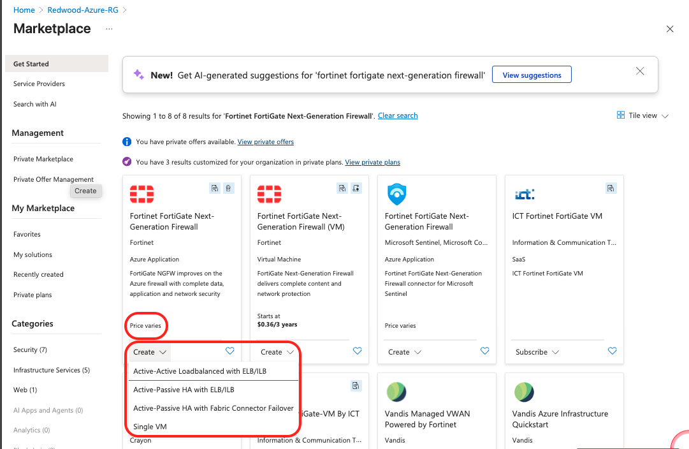

### PAYG (Pay As You Go) - Alternative

- License bundled into hourly Azure billing
- No upfront licensing cost
- Higher ongoing cost
- Good for POCs and short-term testing

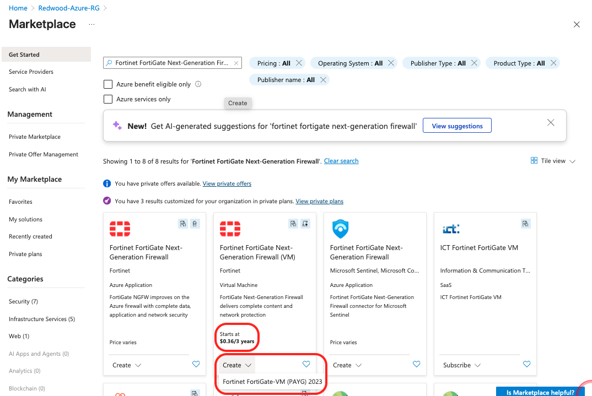

</details>

---

## Step 2: FortiGate Configurations

The Basics tab configures foundational VM settings: location, sizing, and admin credentials.

1. **Basics** configuration:
   - **Resource group**: `Redwood-Azure-RG` (created in Lab 1)
   - **Region**: `Canada Central`
   - **FortiGate VM instance Architecture**: `X64 - Intel / AMD based processors | Gen2 VM FortiGate 7.6+`
   - **Username**: `fortiuser`
   - **Password**: Choose a strong password
     - Requirements: 12+ characters, uppercase, lowercase, number, special character
     - ⚠️ **Critical:** Write this down securely - you'll need it immediately after deployment
   - **FortiGate Name Prefix**: `Redwood-Azure`

   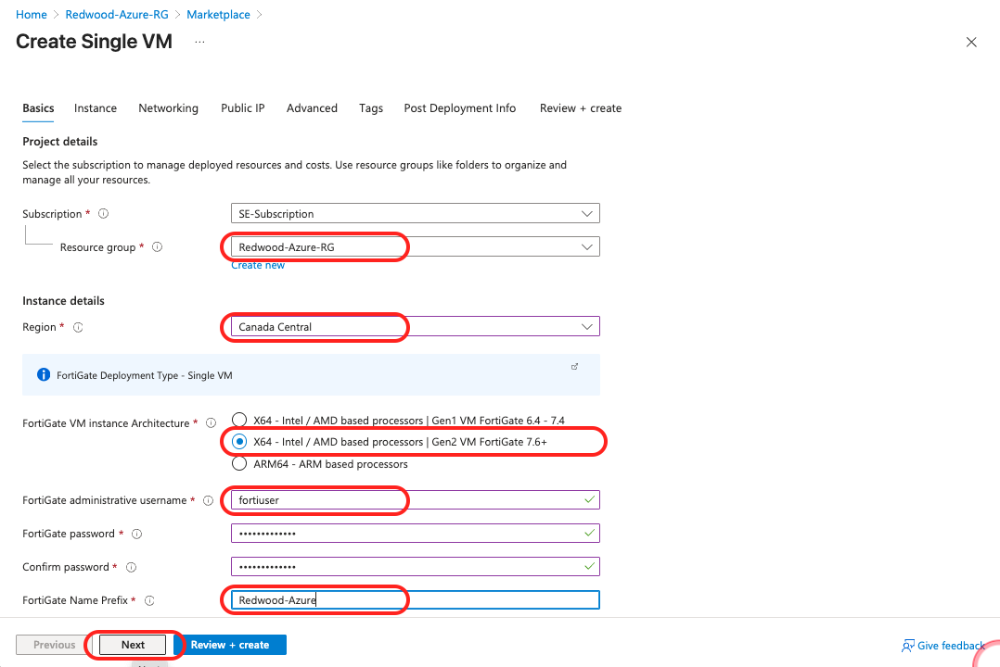

   - Click **Next**

2. **Instance** configurations:
   - **FortiGate Image SKU**: `Bring Your Own License or FortiFlex`
   - **FortiGate Image Version**: `7.6.4`
   - **Instance Type**: `Standard_D2_v4` (default for single VM)
   - **Availability Option**: `No infrastructure redundancy required`

   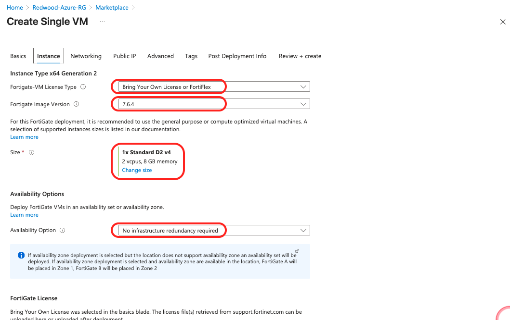

   Configuring **Licensing:**
   - Check **"My organization is using the FortiFlex subscription service"**
   - **FortiFlex Token**: `[Token provided by instructor]`
   - Name of the FortiGate VM: `Redwood-Azure-FGT`

   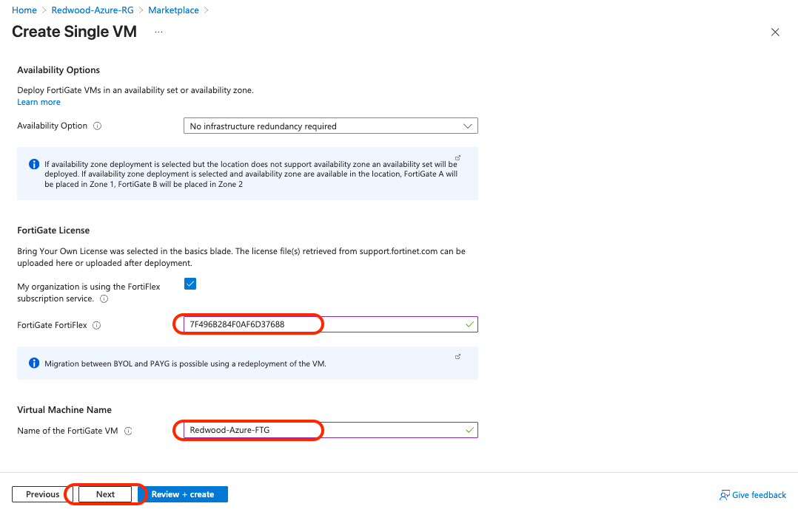

   - Click **"Next"**

3. Configure **Networking** Settings

   [ATTENTION!] Do not create a new VNet!

   - **Virtual Network**: Select `Redwood-Azure-VNet (Redwood-Azure-RG)`
   - **Subnet Mapping**:
   - **External Subnet**: `External-Subnet`
   - **Internal Subnet**: `Internal-Subnet`
   - **Protected Subnet**: `Protected-Subnet`  
   - **Accelerated Networking**: `Disabled`

   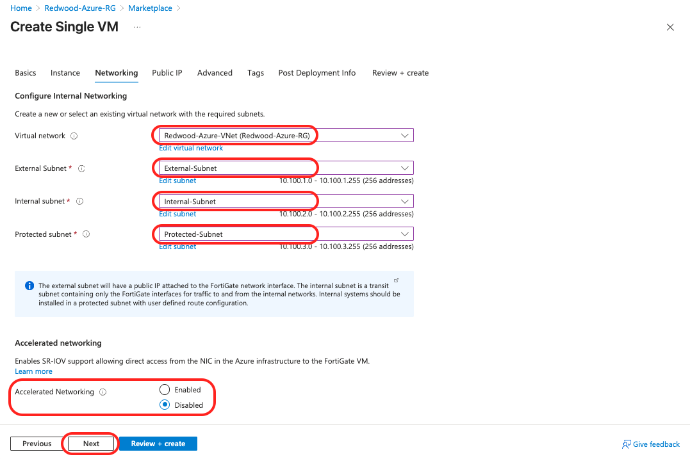

   - Click **"Next"**

4. Configure **Public IP**

   - Click **"Create new"**
      Configure:
      - **Name**: `Redwood-Azure-FGT-PIP`
      - **SKU**: `Standard`
      - **Route preference:** `Microsoft network`
      - Click **OK**

    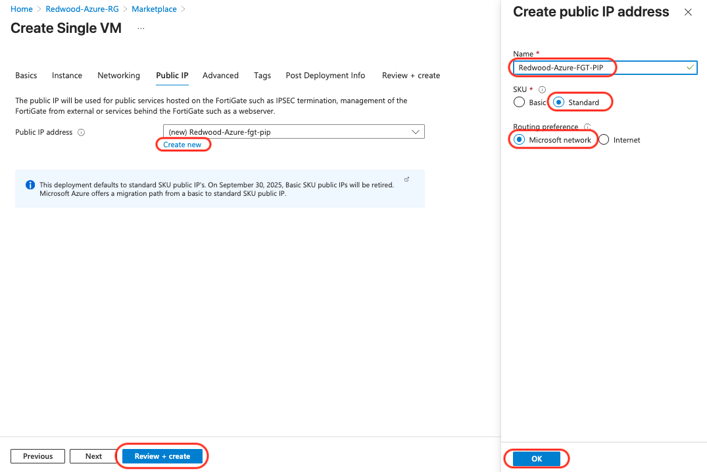

   **Validation**

   - ✅ All required fields filled (no red asterisks remaining)
   - ✅ Region shows "**Canada Central**"
   - ✅ Instance type shows "**Standard_D2_v4**"
   - ✅ Username and password recorded securely

5. Deploy

   - Click **"Review + create"** then **"Create"**
   - Wait for deployment to complete (~10-15 minutes)

---

### Troubleshooting Deployment Failures

If deployment fails, check:

| Error | Possible Cause | Solution |
| --- | --- | --- |
| "Quota exceeded" | Not enough vCPU quota in region | Request quota increase via Azure Portal → Support |
| "Subnet not available" | Subnet specified doesn't exist | Verify Lab 1 completed, check subnet names |
| "IP address in use" | 10.100.2.4 already assigned | Check for other VMs in Internal-Subnet, use different IP or delete conflicting resource |

**If deployment fails:**

1. Note the specific error message
2. Check Activity Log (Resource Group → Activity log)
3. Fix the issue
4. Delete the partial deployment resources
5. Retry from Step 1

---

## Step 3: Retrieve FortiGate Public IP

You need FortiGate's Public IP to access the web management interface.

1. **Navigate to Resource Group:**
   - Search for **Redwood-Azure-RG** resource group in Azure Portal

2. **Find Public IP Resource:**
   - Look for resource named **Redwood-Azure-FGT-PIP** (Type: Public IP address)
   - Click on the resource

3. **Copy IP Address:**
   - In the Overview page, find **IP address** field
   - Example: `4.220.137.45`
   - Click the copy icon next to the IP
   - ⚠️ **Write this down** - you'll use it multiple times

### Validation

- ✅ You have copied an IP address in format: `4.x.x.x` or `52.x.x.x` (Canada Central IPs)
- ✅ IP address is written down or saved

---

## Step 4: First-Time FortiGate Login

Access FortiGate web GUI and perform initial setup.

1. **Open Web Browser:**
   - Use Chrome or Firefox (recommended)
   - Internet Explorer/Edge Legacy not supported

2. **Navigate to FortiGate:**
   - Enter in address bar: `https://<FortiGate-Public-IP>`
   - Example: `https://20.220.137.45`
   - Press Enter

3. **Certificate Warning (Expected):**
   - You'll see "Your connection is not private" warning
   - This is normal - FortiGate uses self-signed certificate
   - **Chrome:** Click **Advanced** → Click **Proceed to [IP] (unsafe)**
   - **Firefox:** Click **Advanced** → Click **Accept the Risk and Continue**

4. **FortiGate Login Page:**
   - You should see FortiGate login screen
   - Fortinet logo at top
   - Username and password fields

5. **Initial Login:**
   - **Username:** Enter `fortiuser`
   - **Password:** Enter the password you created before
   - Click **Login** button

6. **Dashboard Loads:**
   - You should see FortiGate Dashboard
   - System Status, FortiGuard Status, and other widgets visible

   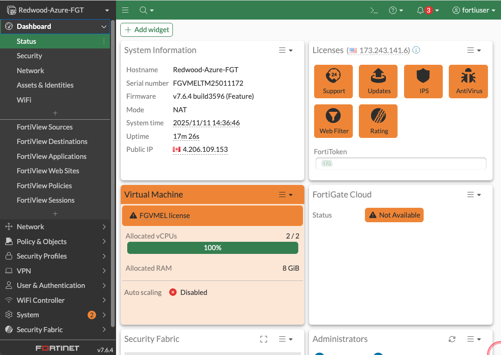

**Validation:**

- ✅ FortiGate Dashboard visible
- ✅ System shows "OK" status
- ✅ You're logged in as fortiuser

### Troubleshooting Access Issues

| Issue | Solution |
|-------|----------|
| "Can't reach this page" / Timeout | Verify Public IP correct, check NSG allows port 443, wait 2-3 minutes after deployment |
| "Connection refused" | FortiGate may still be initializing, wait 5 minutes and retry |
| Wrong password | Make sure that you are using the password you configured before. Is `caps lock` active? |
| Can't find instance ID | Azure Portal → VM → Overview → Properties → Look for VM ID |
| Browser shows "ERR_CERT_AUTHORITY_INVALID" | Normal, proceed anyway (self-signed cert) |

---

## PART 2: Traffic Steering Configuration

Now that FortiGate is deployed and licensed, configure Azure routing to force traffic through it for inspection.

---

### Step 5: Create Route Table

A Route Table holds User Defined Routes (UDRs) that override Azure's default routing behavior.

1. In **`Redwood-Azure-RG`** resource group, click **"+ Create"**

2. Search for: **`route table`**
   - Click **Create** button and select **Route table**

   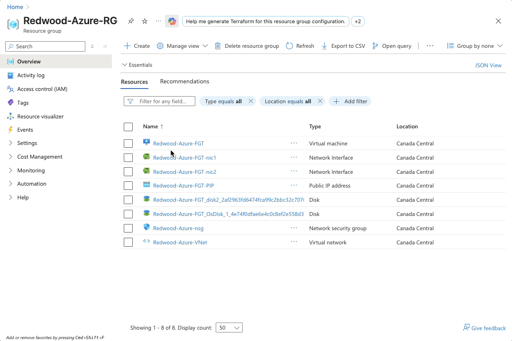

3. **Basics Tab:**
   - **Subscription:** Select your Azure subscription
   - **Resource group:** Select **Redwood-Azure-RG**
   - **Region:** Select **Canada Central**
     - ⚠️ **Critical:** Must match VNet region
   - **Name:** Enter `Redwood-Azure-RT-Protected`
     - Naming convention: RT = Route Table, Protected = associated subnet
   - **Propagate gateway routes**: `No`

   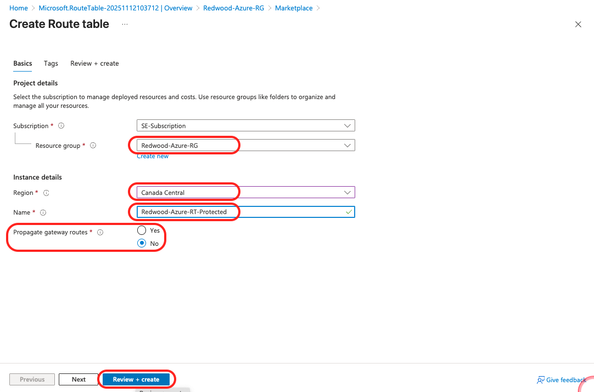

4. **Review and Create:**
   - Click **Review + create** button
   - Review settings
   - Click **Create** button

5. **Wait for Creation:**
   - Deployment takes 10-15 seconds
   - You'll see "Your deployment is complete" message
   - Click **Got to resource** button

**Validation:**

- ✅ Redwood-Azure-RT-Protected appears in Resources list
- ✅ Location shows "Canada Central"
- ✅ Resource group shows "Redwood-Azure-RG"
- ✅ No routes listed yet (we'll add them next)

### Understanding Route Tables

**What they do:**

- Override Azure's default routing (system routes)
- Force traffic to specific next-hops (like FortiGate)
- Enable security inspection, VPN routing, or custom network paths

**How they work:**

- Route table created (this step)
- Routes added to table (next steps)
- Table associated with subnet(s) (later step)
- All VMs in associated subnet(s) automatically use these routes

---

#### Step 6: Find FortiGate Internal IP

1. Navigate to **`Redwood-Azure-RG`**
2. Find and click **`Redwood-Azure-FGT-nic2`** (internal NIC)
3. Note the **Private IP address** (should be `10.100.2.4`)

   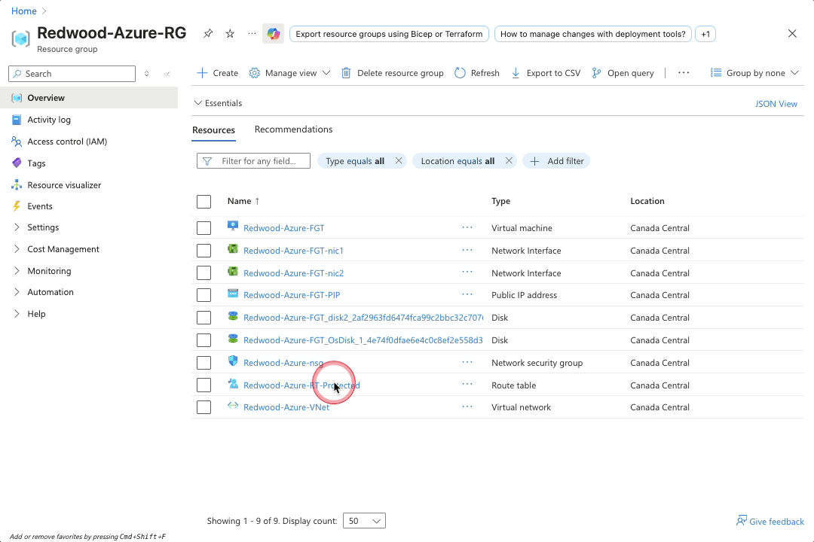

#### Step 7: Associate Route Table with Subnet

1. Go to the route table **`Redwood-Azure-RT-Protected`** resource
2. Under **Settings**, click **"Subnets"**
3. Click **"+ Associate"**
4. Configure:
   - **Virtual network**: `Redwood-Azure-VNet`
   - **Subnet**: `Protected-Subnet`
5. Click **"OK"**

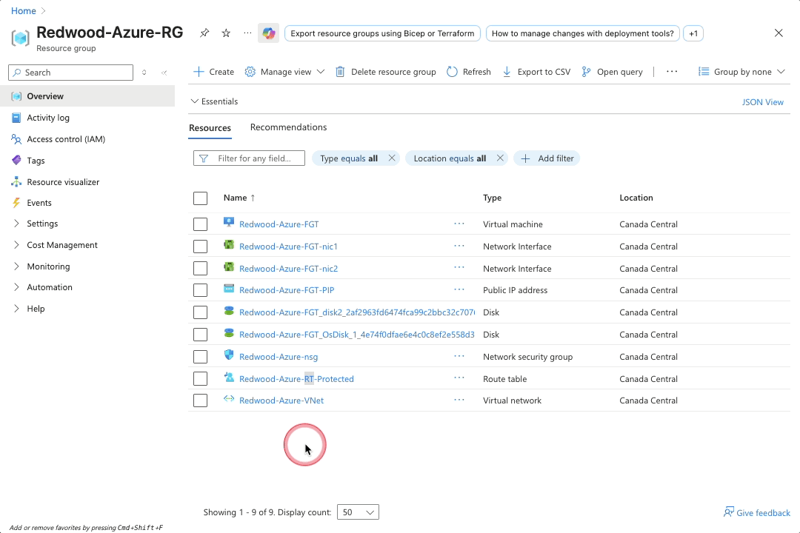

**Validation:**

- ✅ Protected-Subnet appears in "Associated subnets" list
- ✅ Virtual network shows "Redwood-Azure-VNet"
- ✅ Subnet shows "Protected-Subnet"

### Understanding Route Table Association

**Before Association:**

- Route table exists but has no effect
- Protected-Subnet uses Azure's default routing
- VMs can reach internet directly (bypassing FortiGate)

**After Association:**

- Any resource deployed in Protected-Subnet automatically uses these routes
- Traffic to internet (0.0.0.0/0) → forced to 10.100.2.4 (to be configured next)
- FortiGate becomes the security checkpoint for all traffic

**Critical Concept:** Route table association is per-subnet, not per-VNet. If you add more Protected subnets in the future, you must associate the route table with each one.

---

#### Step 8: Add Default Route to Internet via FortiGate

1. In **`Redwood-Azure-RT-Protected`**, under **Settings**, click **"Routes"**
2. Click **"+ Add"**
3. Configure:
   - **Route name**: `to_internet`
   - **Destination type**: `IP Addresses`
   - **Destination IP addresses/CIDR ranges**: `0.0.0.0/0`
   - **Next hop type**: `Virtual appliance`
   - **Next hop address**: `10.100.2.4`
4. Click **"Add"**

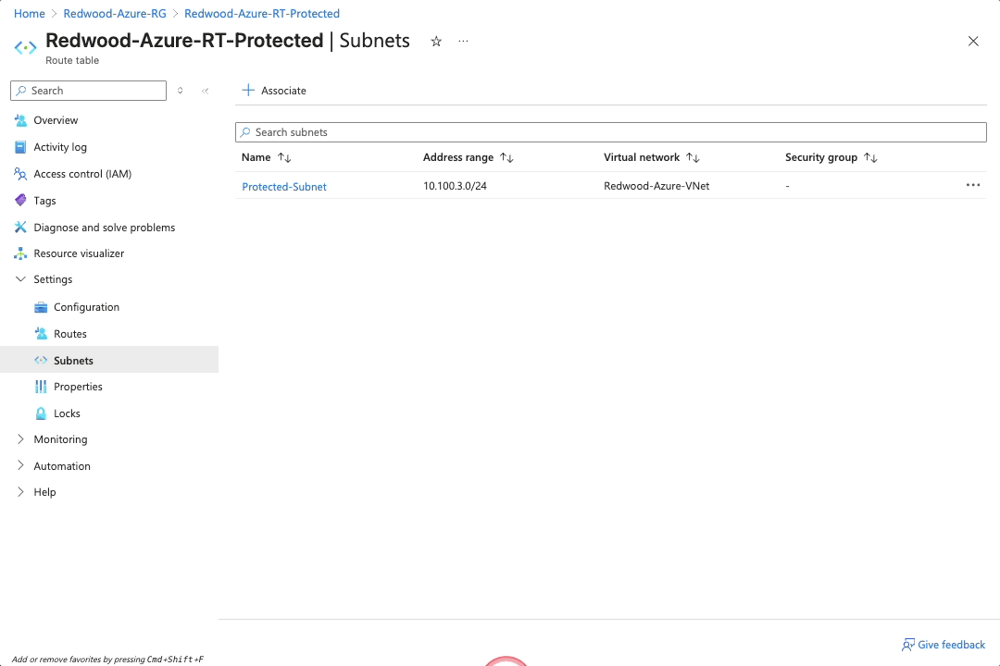

**Validation:**

- ✅ "to_internet" route appears in routes list
- ✅ Address prefix shows "0.0.0.0/0"
- ✅ Next hop type shows "Virtual appliance"
- ✅ Next hop address shows "10.100.2.4"

### Understanding This Route

**What it does:**

- Any VM in Protected-Subnet trying to reach internet
- Azure checks this route first (UDRs override system routes)
- Traffic sent to FortiGate (10.100.2.4) instead of Azure's default gateway
- FortiGate inspects traffic, applies policies, then forwards to internet

**Why 0.0.0.0/0:**

- Represents "all destinations"
- Most specific route wins (Azure uses longest prefix match)
- Without more specific routes, this catches everything

**Traffic flow:**

```text
VM (10.100.3.5) → wants google.com
  ↓ (checks route table)
0.0.0.0/0 matches! → next-hop = 10.100.2.4
  ↓
FortiGate port2 receives packet
  ↓ (inspect, apply policy, NAT)
FortiGate port1 sends to internet
```

---

## Lab 2 Complete! 🎉

### What You've Accomplished

You have successfully deployed FortiGate VM and configured Azure traffic steering:

✅ **FortiGate VM deployed** in Redwood-Azure-RG (Canada Central)  
✅ **port1 (External)** configured with Public IP for internet and management  
✅ **port2 (Internal)** configured with static IP **10.100.2.4** (matching UDRs)  
✅ **FortiGate licensed** with FortiFlex token (BYOL)  
✅ **Web GUI access** working via HTTPS  
✅ **Route Table created** (RT-Protected)  
✅ **Internet route** forcing traffic to FortiGate (0.0.0.0/0 → 10.100.2.4)  
✅ **Route table associated** with Protected-Subnet

### Architecture Review

Current State After Lab 2:


✓ FortiGate deployed and licensed
✓ UDR forces Protected-Subnet traffic to FortiGate
✓ Ready for policies (Lab 3)!

### Key Takeaways

1. **Interface Configuration is Critical:**
   - port2 IP (10.100.2.4) must match UDR next-hop
   - IP address can be changed after deployment

2. **User Defined Routes (UDRs) Override Default Routing:**
   - Without UDR: VMs access internet directly (bypassing FortiGate)
   - With UDR: Traffic forced through FortiGate for inspection
   - UDRs are the key to centralized security inspection

3. **BYOL Licensing:**
   - FortiFlex tokens provide flexibility
   - Can move licenses across clouds and on-prem
   - Cost-effective for production deployments

4. **Route Table Association Matters:**
   - Route tables don't work until associated with subnet
   - Association is per-subnet, not per-VNet
   - Protected-Subnet now forces all traffic through FortiGate

### Next Steps

Ready for **Lab 3: Security Policies & Test VM!**

In Lab 3, you will:

- Deploy test VM in Protected-Subnet
- Create firewall policies for outbound internet access
- Configure NAT for traffic leaving to internet
- Test traffic flow and verify inspection
- Use FortiGate logs and FortiView to monitor traffic
- Troubleshoot blocked traffic scenarios

### Quick Reference

**FortiGate Access:**

- URL: `https://<Your-Public-IP>`
- Username: `fortiuser`
- Password: (The new password you set)

**Interface Configuration:**

- port1 (External): Public IP, internet access, management NATed to 10.100.1.4/24
- port2 (Internal): 10.100.2.4/24, inspection interface

**License Status:**

- System → FortiGuard → Should show "Valid"
- Services: IPS, AV, Web Filtering, App Control included

**Routing:**

- `Redwood-Azure-RT-Protected` associated with Protected-Subnet
- Route: 0.0.0.0/0 → 10.100.2.4 (FortiGate port2)

---

## Troubleshooting Guide

### Can't Access FortiGate GUI

**Check List:**

1. Verify Public IP is correct (Resource Group → Public IP resource)
2. Verify NSG allows HTTPS (port 443) from your IP
3. Wait 2-3 minutes after deployment (FortiGate initialization time)
4. Try different browser or incognito mode
5. Check FortiGate VM is running (Azure Portal → VM → Status should be "Running")

### License Activation Failed

**Check List:**

1. Token still valid? (Ask the instructor) 
2. FortiGate can reach internet (System → Network → Interfaces → port1 up?)
3. Token not already used on different device (you can only use the token once.)

### Wrong Interface Configuration

**If port2 IP is not 10.100.2.4:**

- ⚠️ **Problem:** Traffic won't route through FortiGate
- **Solution:** Must correct the FortiGate port2 static IP. Ensuring port2 set to **Static** IP **10.100.2.4**

### Route Table Not Working

**Check List:**

1. Verify route table is associated with Protected-Subnet (Redwood-Azure-RT-Protected → Subnets)
2. Verify route destination is 0.0.0.0/0 (Redwood-Azure-RT-Protected → Routes)
3. Verify next-hop address is 10.100.2.4 (must match port2 IP exactly)
4. Wait 60 seconds after association for routes to propagate

---

**End of Lab 2:**

*Estimated completion time: 60 minutes*  
*Next: Lab 3 - Security Policies & Test VM*

---

*Lab Guide Version 2.0 - November 2025*  
*Questions? Ask your instructor or refer to troubleshooting section.*
