# AZ-101 Lab 3: Security Policies & Traffic Testing

## Lab Overview

**Duration:** 40 minutes  
**Difficulty:** Intermediate  
**Prerequisites:** Completed Lab 1 and Lab 2, FortiGate licensed and accessible

### Objective

Deploy a test VM to generate traffic, configure FortiGate firewall policies to allow and inspect outbound internet traffic, and validate that traffic flows correctly through FortiGate with proper NAT translation.

### What You'll Build

By the end of this lab, you will have:

- ✅ Test VM deployed in Protected-Subnet
- ✅ Firewall policy allowing outbound internet access
- ✅ NAT configuration for internet-bound traffic
- ✅ Create a VIP address for the Test VM
- ✅ Traffic flowing through FortiGate for inspection
- ✅ Logs showing inspected traffic
- ✅ FortiView visualization of traffic flows
- ✅ Troubleshooting experience with blocked traffic

### Architecture

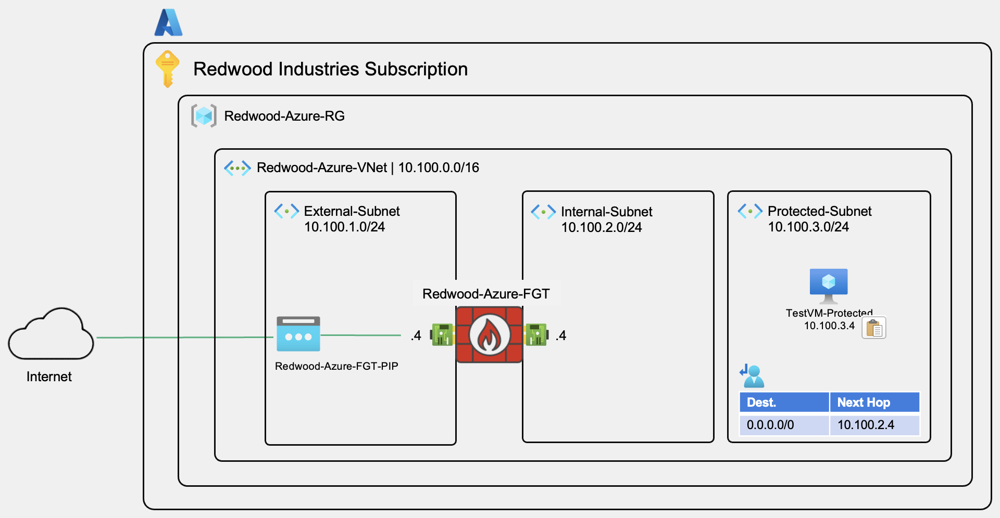

### Business Context

Redwood Industries needs to deploy their first Azure workload - a test application server. Before production deployment, the security team requires validation that all internet-bound traffic flows through FortiGate for inspection, maintaining compliance with corporate security policies. In this lab, you'll deploy a test VM, configure the security policies, and validate proper traffic inspection.

---

## Step 1: Deploy Test VM in Protected Subnet

We need a VM in Protected-Subnet to generate traffic and test FortiGate inspection.

### 1.1 Start VM Creation

1. Navigate to your **`Redwood-Azure-RG`** resource group
2. Click **"+ Create"**
3. Search for: **`virtual machine`**
4. Select **"Virtual machine"** and click **"Create > Virtual machine"**

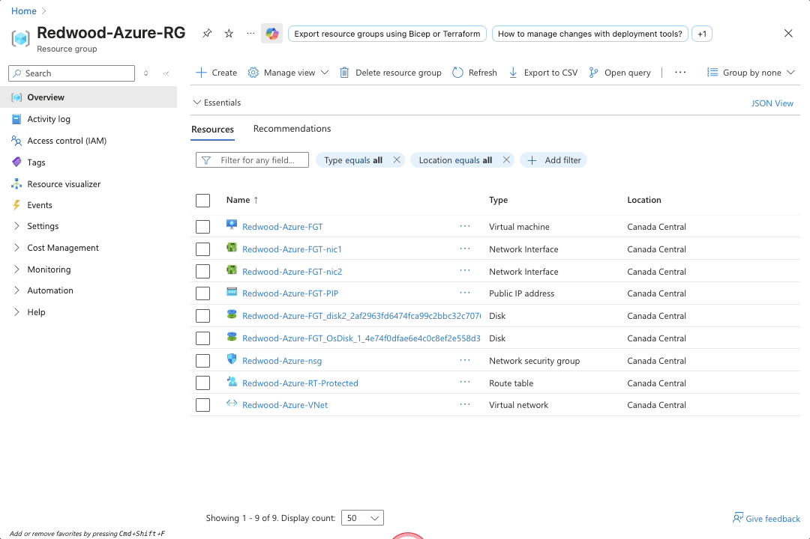

### 1.2 Configure VM Basics

1. **Basics** tab configuration:
   - **Virtual machine name**: `TestVM-Protected`
   - **Region**: `Canada Central`
   - **Availability options**: `No infrastructure redundancy required`
   - **Image**: `Ubuntu Server 24.04 LTS - x64 Gen2`
   - **VM architecture**: `x64`
   - **Size**: `Standard_B1ms - 1 vcpus, 2 GiB memory`

   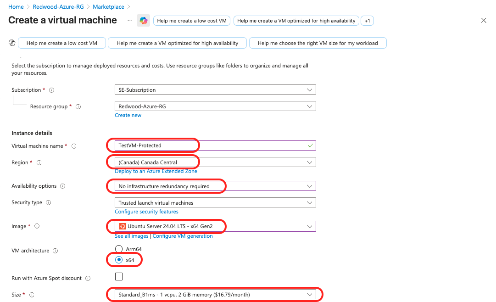

### 1.3 Configure Authentication

1. **Authentication type**: `Password`
2. **Username**: `azureuser`
3. **Password**: Create a strong password (save it securely!)
4. **Confirm password**: Re-enter your password
5. **Public inbound ports**: `None` ⚠️ **IMPORTANT**

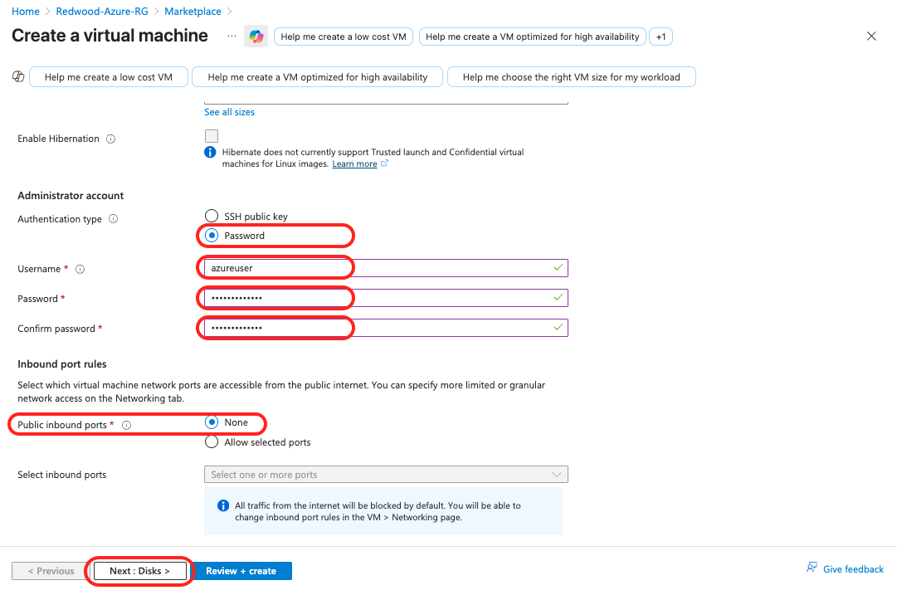

### 1.4 Configure VM Disks

1. Click **"Next: Disks >"**
2. Keep default disk configurations (Premium SSD, Image default (30 GiB))

### 1.5 Configure VM Networking

1. Click **"Next: Networking >"**

2. **Networking** tab configuration:
   - **Virtual network**: `Redwood-Azure-VNet (Redwood-Azure-RG)`
   - **Subnet**: `Protected-Subnet (10.100.3.0/24)`
   - **Public IP**: `None` ⚠️ **IMPORTANT**
   - **NIC network security group**: `Basic`
   - Keep other default settings

   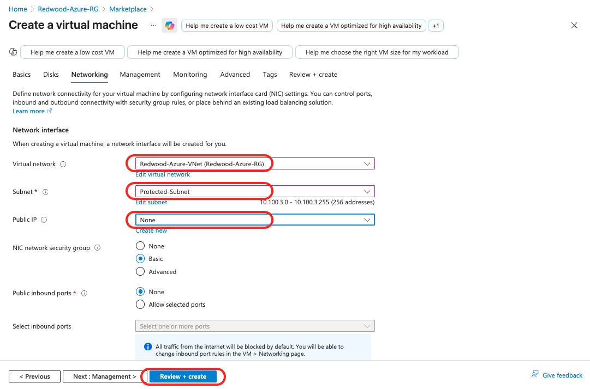

3. Click **"Review + create"**
4. Click **"Create"**

> [!NOTE]
> VM creation typically takes 3-5 minutes. The VM will have no public IP address - we'll access it using a VIP configuration in FortiGate.

---

## Step 2: FortiGate Configuration

### 2.1 Create the Address object for the `TestVM-Protected` VM

1. Login into `Redwood-Azure-FGT`

2. Navigate to **Policy & Objects** in the left menu
   - Click **Addresses**
   - Click **+ Create new**
   - In the **New Address** tab:
     - **Name**: `TESTVM-PROTECTED`
     - **Interface**: `port2`
     - **Type**: `Subnet`
     - **IP/Netmask**: `10.100.3.4 255.255.255.255`
     - Click **OK**

   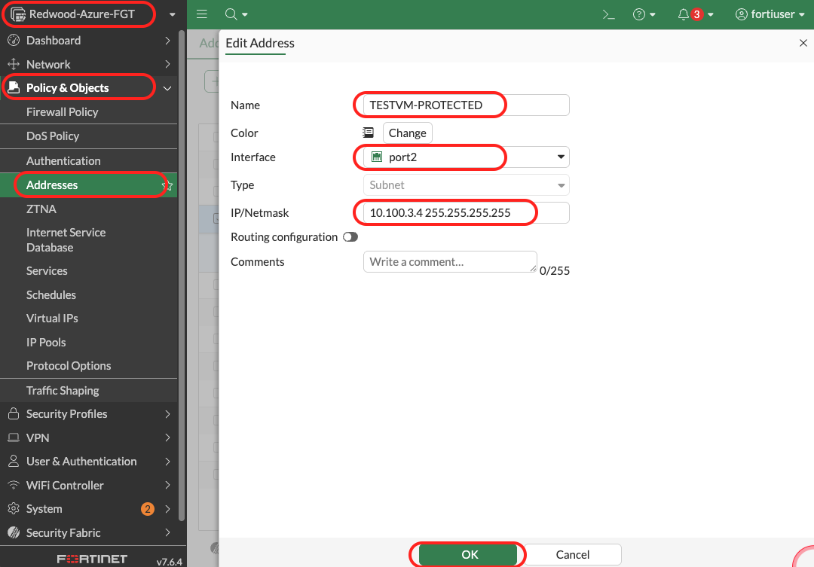

### 2.1 Create the Virtual IP for the SSH and HTTP access to the `TestVM-Protected` VM

1. Navigate to **Policy & Objects** in the left menu
   - Click **Virtual IPs**
   - Click **+ Create new**
   - In the **New Virtual IP** tab:
     - **Name**: `TESTVM-PROTECTED-VIP-SSH`
     - **Interface**: `port1`
     - **External IP address/range**: 0.0.0.0
     - Map to
       - **IPv4 address/range**: Select the `TESTVM-PROTECTED` from the Suggestions
     - Enable `Port Forwarding`
       - **Protocol**: `TCP`
       - **Port Mapping Type**: `One to one`
       - **External service port**: `2222`
       - **Map to IPv4 port**: `22`
     - Click **OK**

   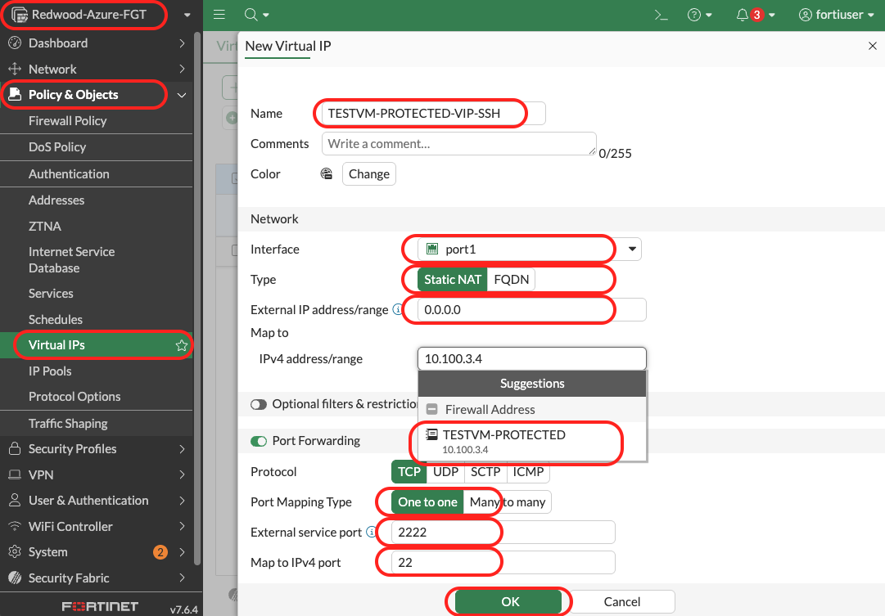

2. Again in **Virtual IPs**
   - Click **+ Create new**
   - In the **New Virtual IP** tab:
     - **Name**: `TESTVM-PROTECTED-VIP-HTTP`
     - **Interface**: `port1`
     - **External IP address/range**: 0.0.0.0
     - Map to
       - **IPv4 address/range**: Select the `TESTVM-PROTECTED` from the Suggestions
     - Enable `Port Forwarding`
       - **Protocol**: `TCP`
       - **Port Mapping Type**: `One to one`
       - **External service port**: `8080`
       - **Map to IPv4 port**: `80`
     - Click **OK**
  
   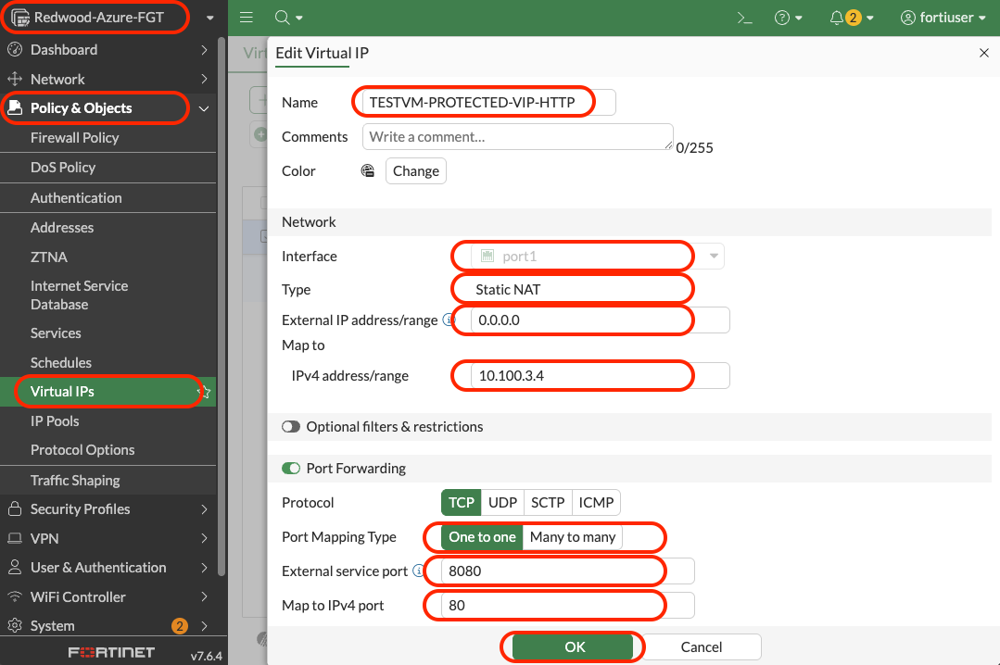

### 2.2 Create the Virtual IP Group to aggregate SSH and HTTP access to the `TestVM-Protected` VM in one object

1. Navigate to **Policy & Objects** in the left menu
   - Click **Virtual IPs**
   - Select the **Virtual IP Group** tab on the top of the page
   - Click **+ Create new**
   - In the **New VIP Group** tab:
     - **Name**: `TESTVM-PROTECTED-VIPGRP`
     - **Interface**: `port1`
     - **Members**: add `TESTVM-PROTECTED-VIP-SSH` and `TESTVM-PROTECTED-VIP-HTTP`
   - Click **OK**
  
   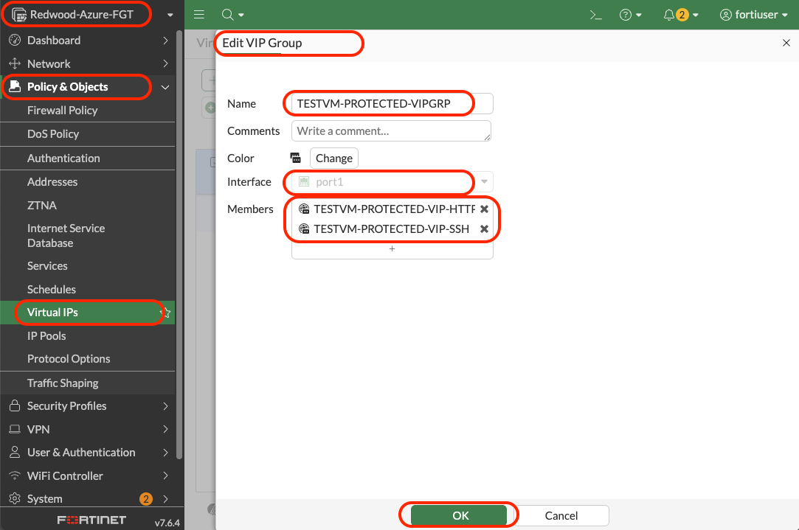

### 2.3 Create the Firewall policy to allow traffic to the `TestVM-Protected`

1. Navigate to **Policy & Objects** in the left menu
   - Click **Firewall Policy**
   - Click **+ Create new**
   - In the **Create New Policy** tab:
     - **Name**: `testvm_access_vip`
     - **Income interface**: `port1`
     - **Outgoing interface**: `port2`
     - **Source**: `all`
     - **Destination**: `TESTVM-PROTECTED-VIPGRP`
     - **Service**: `SSH` and `HTTP`

     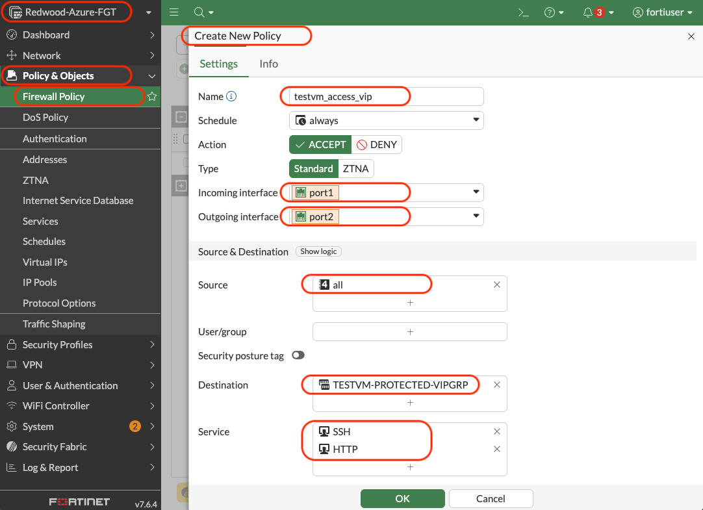

     - **Log allowed traffic**: `All sessions`

     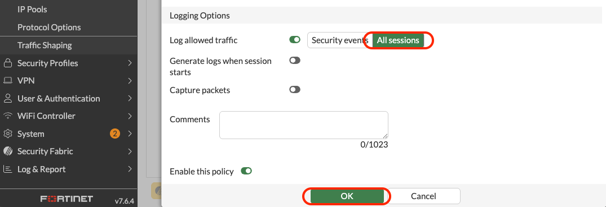

   - Click **OK**

---

## Step 3: Test SSH connectivity to the `TestVM-Protected` VM

### 3.1 Connect to the `TestVM-Protected` VM using SSH using the VIP you created

1. Open the Azure Cloud Shell

2. SSH into the `TestVM-Protected`

   ```bash
   ssh -p 2222 azureuser@<Redwood-Azure-FGT_public_ip>
   ```

3. Confirm that you want to continue connecting

   ```bash
   Are you sure you want to continue connecting (yes/no/[fingerprint])? yes
   ```  

4. Enter your password

   ```bash
   azureuser@4.206.109.153's password: 
   ```

   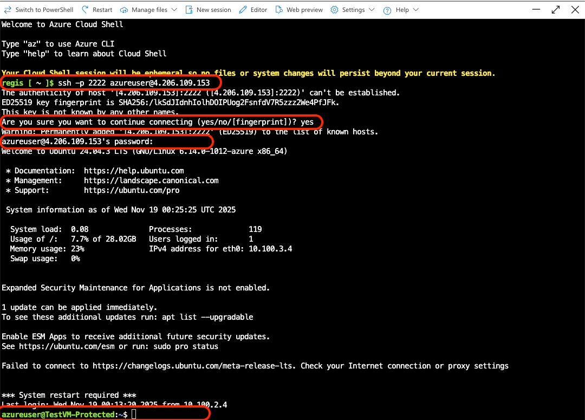

   If you configured the FortiGate properly - the VIP and the firewall rule - you will be able to connect and get into the prompt.

   ```bash
   azureuser@TestVM-Protected:~$ 
   ```

### 3.2 Test the `TestVM-Protected` VM for internet access

1. Ping an IP over the internet - i.e.: 8.8.8.8

   ```bash
   ping 8.8.8.8
   ```

   What is the result? Why is this happening? What is missing?

---

## Step 4: Creating a firewall rule for the `TestVM-Protected` VM to access internet

### 4.1 Create the Firewall policy to allow the `TestVM-Protected` VM to access the internet

1. Navigate to **Policy & Objects** in the left menu
   - Click **Firewall Policy**
   - Click **+ Create new**
   - In the **Create New Policy** tab:
     - **Name**: `internet_access`
     - **Income interface**: `port2`
     - **Outgoing interface**: `port1`
     - **Source**: `all`
     - **Destination**: `all`
     - **Service**: `ALL`
     - **Log allowed traffic**: `All sessions`

   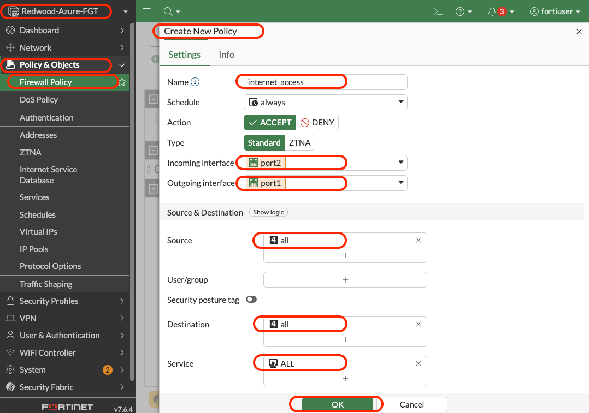

   - Click **OK**

---

## Step 5: Test the `TestVM-Protected` VM to access internet

### 5.1 Test the `TestVM-Protected` VM again

1. Ping an IP over the internet - i.e.: 8.8.8.8

   ```bash
   ping -c 3 8.8.8.8
   ```

   The expected result is the following:

   ```console
   azureuser@TestVM-Protected:~$ ping -c 3 8.8.8.8
   PING 8.8.8.8 (8.8.8.8) 56(84) bytes of data.
   64 bytes from 8.8.8.8: icmp_seq=1 ttl=112 time=10.6 ms
   64 bytes from 8.8.8.8: icmp_seq=2 ttl=112 time=10.0 ms
   64 bytes from 8.8.8.8: icmp_seq=3 ttl=112 time=10.7 ms

   --- 8.8.8.8 ping statistics ---
   3 packets transmitted, 3 received, 0% packet loss, time 2003ms
   rtt min/avg/max/mdev = 10.036/10.448/10.693/0.293 ms
   azureuser@TestVM-Protected:~$
   ```

2. **Test DNS Resolution:**

   ```bash
   ping -c 4 www.google.com
   ```

   Should resolve to an IP and get replies

3. **Test HTTP/HTTPS:**

   ```bash
   curl -I https://www.fortinet.com
   ```

   **Expected:** HTTP 200 OK response with headers

4. **Test Different Destination:**

   ```bash
   curl -I https://www.microsoft.com
   ```

   **Expected:** HTTP 200 OK response with headers

### Validation

- ✅ Ping to 8.8.8.8 succeeds (0% packet loss)
- ✅ DNS resolution works (`www.google.com` resolves)
- ✅ HTTP/HTTPS requests succeed
- ✅ Internet connectivity working through FortiGate

---

## Step 6: Verify Traffic in FortiGate Logs

Confirm FortiGate is inspecting traffic and logging it.

### Instructions

1. **Navigate to Forward Traffic Logs:**
   - In FortiGate GUI, click **Log & Report** in left menu
   - Click **Forward Traffic**
   - You should see log entries from your ping/curl (HTTP/S) tests

   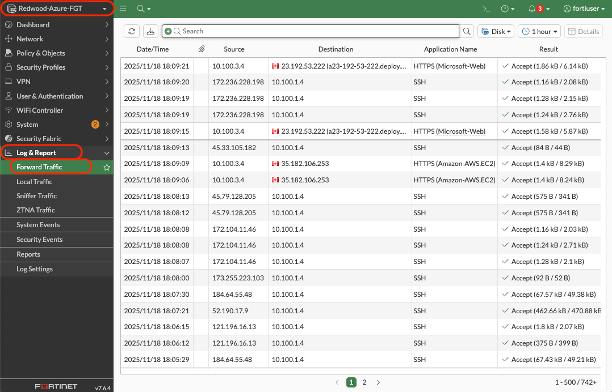

2. **Filter for Your Traffic:**
   - Click **Advanced Filters** button (or filter icon)
   - **Source IP:** Enter `10.100.3.4` (or your TestVM IP)
   - Click **Apply Filter**

   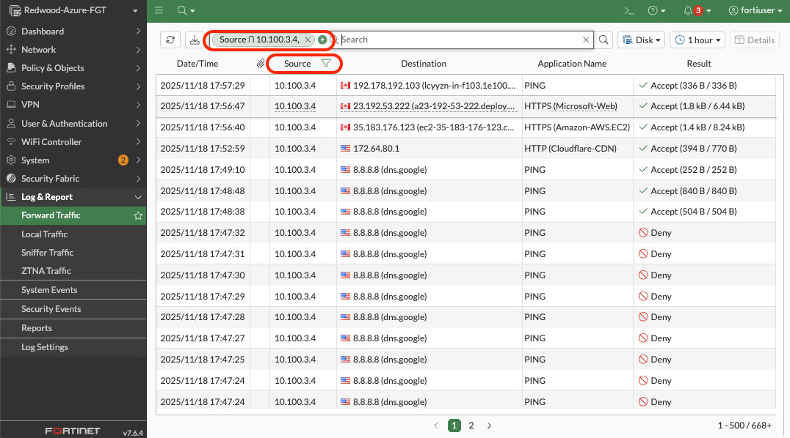

3. **Examine Log Entries:**
   - Each row represents a traffic session
   - Click on a log entry to see details
   - **Key fields to observe:**
     - **Source IP:** `10.100.3.4` (TestVM)
     - **Destination IP:** 8.8.8.8 or other internet IPs
     - **Source Interface:** port2 (Internal)
     - **Destination Interface:** port1 (External)
     - **Policy:** `internet_access`
     - **Action:** accept
     - **NAT:** Yes (should show NAT was applied)
     - **Bytes Sent/Received:** Non-zero values

4. **View Details:**
   - Click on a log entry
   - Detailed view shows:
     - Original source IP: 10.100.3.4
     - Translated source IP: FortiGate Public IP
     - Full 5-tuple: src IP, src port, dst IP, dst port, protocol
     - Policy matched

### Validation

- ✅ Log entries visible in Forward Traffic
- ✅ Source IP is 10.100.3.4 (TestVM)
- ✅ Policy shows "internet_access"
- ✅ Action shows "ACCEPT"
- ✅ NAT translation visible
- ✅ Different protocols visible (ICMP, HTTPS, etc.)

### Understanding FortiGate Logs

**Log Types:**

- **Forward Traffic:** Allowed/denied traffic through FortiGate
- **Local Traffic:** Traffic to/from FortiGate itself
- **VPN Events:** VPN tunnel status changes
- **System Events:** Configuration changes, admin logins

**Forward Traffic Log Importance:**

- Proves traffic is flowing through FortiGate
- Shows policy matches
- Essential for troubleshooting
- Required for compliance (PCI-DSS, etc.)

---

## Step 6: Visualize Traffic with FortiView

FortiView provides real-time visual dashboards for traffic analysis.

1. **Navigate to FortiView Sources:**
   - Click **Dashboard** in left menu
   - Click **FortiView Sources**

2. **Explore Sources Dashboard:**
   - You'll see active and recent sources
   - Click in one **Source** and select `Drill down`
   - Click **View session logs**

3. **View Traffic Details:**
   - Click on a session to see:
     - Full connection details
     - Bytes transferred
     - Application identified
     - Policy that matched
     - Security profile actions (if enabled)

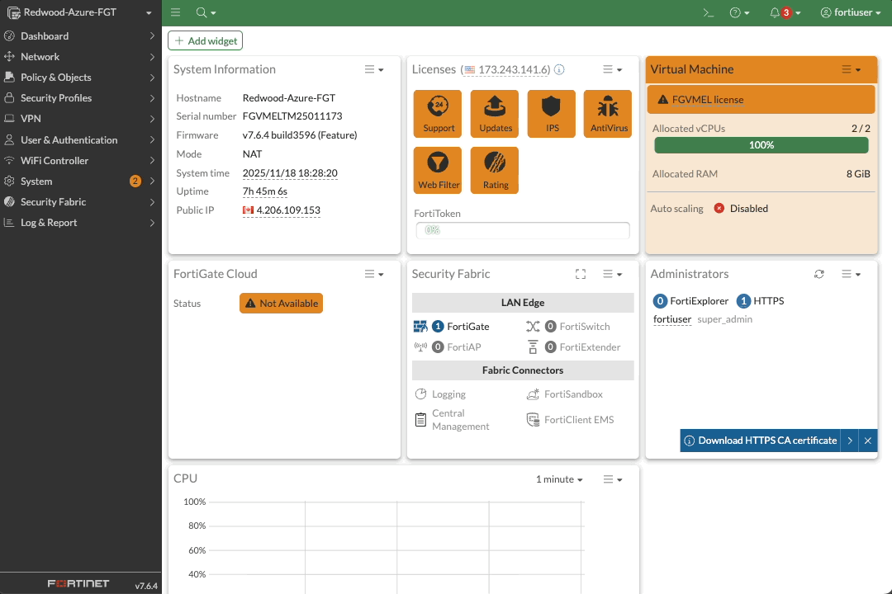

### Validation

- ✅ FortiView shows active sessions from 10.100.3.4
- ✅ Can see destination IPs (8.8.8.8, etc.)
- ✅ Applications identified (ICMP, HTTPS, etc.)
- ✅ Visual charts displaying traffic patterns

### Understanding FortiView

**What is FortiView?**

- Real-time network visualization
- No additional configuration needed (uses existing logs)
- Essential for:
  - Troubleshooting connectivity issues
  - Identifying bandwidth hogs
  - Detecting suspicious traffic patterns
  - Understanding application usage

**Business Value:**

- **IT Operations:** Quickly identify network issues
- **Security:** Spot anomalous traffic patterns
- **Compliance:** Demonstrate traffic inspection
- **Capacity Planning:** Understand bandwidth usage

---

## Lab 3 Complete! 🎉

### What You've Accomplished

You have successfully configured security policies and validated traffic inspection:

✅ **Test VM deployed** in Protected-Subnet (10.100.3.4)  
✅ **Address object created** for Protected-Subnet  
✅ **Firewall policy configured** allowing outbound internet access  
✅ **NAT enabled** for internet-bound traffic  
✅ **Internet connectivity tested** from TestVM  
✅ **Traffic logs verified** in FortiGate  
✅ **FortiView visualization** showing traffic flows  
✅ **End-to-end traffic flow validated**

### Architecture Review

```text
Complete Traffic Flow After Lab 3:
┌────────────────────────────────────────────────────────┐
│           Redwood-Azure-VNet (10.100.0.0/16)           │
│                                                        │
│  ┌───────────────┐  ┌──────────────┐  ┌───────────────┐│
│  │   External    │  │   Internal   │  │  Protected    ││
│  │ 10.100.1.0/24 │  │10.100.2.0/24 │  │10.100.3.0/24  ││
│  │               │  │              │  │               ││
│  │  ┌─────────┐  │  │              │  │ ┌────────────┐││
│  │  │FortiGate│  │  │              │  │ │  TestVM    │││
│  │  │  port1  ├──┼──┤  FortiGate   │  │ │ 10.100.3.4 │││
│  │  │ Public  │  │  │    port2     │◄─┤ │            │││
│  │  │20.x.x.x │  │  │  10.100.2.4  │  │ └────────────┘││
│  │  └─────────┘  │  │              │  │               ││
│  └───────────────┘  └──────────────┘  └───────────────┘│
│         ▲                ▲                     │       │
└─────────┼────────────────┼─────────────────────┼───────┘
          │                │                     │
      Internet      Policy: Accept          UDR: 0.0.0.0/0
                    NAT: Enabled            →  10.100.2.4
                    Logging: On
```

### Key Takeaways

1. **UDRs + Policies = Inspection:**
   - UDRs force traffic to FortiGate (Azure routing)
   - Policies control what happens to traffic (FortiGate decision)
   - Both must be configured correctly for traffic to flow

2. **NAT is Essential:**
   - Private IPs cannot route on the internet
   - NAT translates source IP to FortiGate's Public IP
   - Without NAT, packets leave but replies never return

3. **Logging Proves Inspection:**
   - Logs show FortiGate is seeing and processing traffic
   - Essential for troubleshooting
   - Required for security audits and compliance

4. **FortiView Provides Visibility:**
   - Real-time dashboards for traffic analysis
   - No additional configuration required
   - Essential tool for operations and security teams

### Traffic Flow Summary

**Complete Path:**

1. TestVM (10.100.3.4) → Sends packet to internet
2. Azure UDR → Forces packet to 10.100.2.4 (FortiGate port2)
3. FortiGate port2 → Receives packet
4. FortiGate policy → Matches "internet_access" policy
5. FortiGate NAT → Changes source IP to FortiGate Public IP
6. FortiGate port1 → Sends packet to internet
7. Internet response → Returns to FortiGate Public IP
8. FortiGate → De-NATs (Public IP → 10.100.3.4)
9. FortiGate → Forwards to TestVM via port2
10. TestVM receives response

### Next Steps

Ready for **Lab 4: Site-to-Site VPN Configuration!**

In Lab 4, you will:

- Configure IPsec VPN on Azure FortiGate
- Configure matching VPN on on-premises FortiGate
- Establish secure VPN tunnel between Azure and on-prem
- Create firewall policies for VPN traffic
- Test bidirectional connectivity across VPN
- Monitor VPN status and traffic

This completes the hybrid connectivity for Redwood Industries!

---

## Troubleshooting Reference

### Issue: TestVM Can't Reach Internet

**Checklist:**

1. ✓ FortiGate policy "internet_access" enabled?
2. ✓ NAT enabled on policy?
3. ✓ UDR exists (0.0.0.0/0 → 10.100.2.4)?
4. ✓ UDR associated with Protected-Subnet?
5. ✓ TestVM in correct subnet (Protected-Subnet)?
6. ✓ FortiGate port1 can reach internet?

**Advanced Checks:**

- FortiGate CLI:
  
  ```bash
  diagnose debug flow trace start 10
  diagnose debug flow filter addr 10.100.3.4
  diagnose debug enable
  ```

- Generate traffic from TestVM
- Watch FortiGate CLI output - shows policy matching process

### Issue: No Logs Showing in FortiGate

**Checklist:**

1. ✓ "Log Allowed Traffic" enabled on policy?
2. ✓ Logging set to "All Sessions" (not just "Security Events")?
3. ✓ System time correct? (System → Settings → System Time)
4. ✓ Wait 30-60 seconds for logs to populate?

### Issue: Policy Not Matching

**Checklist:**

1. ✓ Policy enabled ?
2. ✓ Incoming interface matches (port2 for Protected-Subnet traffic)?
3. ✓ Source address matches (Protected-Subnet = 10.100.3.0/24)?
4. ✓ Destination is "all" or specific internet address?
5. ✓ Policy order correct (this policy before any deny-all)?

**Use Policy Lookup Tool:**

- Policy & Objects → Policy Lookup
- Enter: Source IP, Destination IP, Protocol, Port
- Shows which policy would match (or "No policy")

### Issue: Traffic Leaves but No Response

**Symptom:** Ping shows packets sent but no replies

**Likely Cause:** NAT disabled

**Solution:**

1. Check policy NAT is enabled (blue toggle)
2. Verify NAT type is SNAT (Source NAT)
3. Verify using "Outgoing Interface Address"
4. Re-enable NAT if needed

**Why:** Without NAT, packets leave with source IP 10.100.3.4 (private). Internet can't route responses back to private IP.

---

## Quick Commands Reference

### TestVM (Ubuntu) Commands

```bash
# Test basic connectivity
ping -c 4 8.8.8.8

# Test DNS
ping -c 4 www.google.com

# Test HTTPS
curl -I https://www.fortinet.com

# Check TestVM's IP address
ip addr show

# Check routing table
ip route show

# Check DNS configuration
cat /etc/resolv.conf

# Generate continuous traffic (for testing)
ping 8.8.8.8
# Press Ctrl+C to stop
```

### FortiGate CLI Commands (Optional)

```bash
# Show firewall policies
show firewall policy

# Show address objects
show firewall address

# Show active sessions
diagnose sys session list

# Show session statistics
diagnose sys session stat

# Packet capture
diagnose sniffer packet any "host 10.100.3.4" 4 10

# Debug flow (policy matching)
diagnose debug flow filter addr 10.100.3.4
diagnose debug flow trace start 10
diagnose debug enable
# Generate traffic
diagnose debug disable

# Show NAT translations
diagnose sys session filter src 10.100.3.4
diagnose sys session list
```

---

**End of Lab 3:**

*Estimated completion time: 40 minutes*  
*Next: Lab 4 - Site-to-Site VPN Configuration*

---

*Lab Guide Version 2.0 - November 2025*  
*Questions? Ask your instructor or refer to troubleshooting section.*
