# AZ-101 Lab 4: Site-to-Site VPN Configuration

## Lab Overview

**Duration:** 35 minutes  
**Difficulty:** Intermediate-Advanced  
**Prerequisites:** Completed Labs 1-3, access to on-premises FortiGate

### Objective

Establish IPsec VPN tunnel between Azure FortiGate and on-premises FortiGate, enabling secure hybrid connectivity for Redwood Industries. This creates a hybrid network solution allowing secure communication between on-premises and cloud resources.

### What You'll Build

By the end of this lab, you will have:

- ✅ IPsec VPN configured on on-premises FortiGate
- ✅ IPsec VPN configured on Redwood-Azure-FTG
 FortiGate
- ✅ VPN tunnel established (Phase 1 & 2 up)
- ✅ Firewall policies automatically created for VPN traffic
- ✅ Bidirectional connectivity between Azure and on-prem networks
- ✅ Understanding of VPN troubleshooting

### Architecture

Final Architecture After Lab 4:

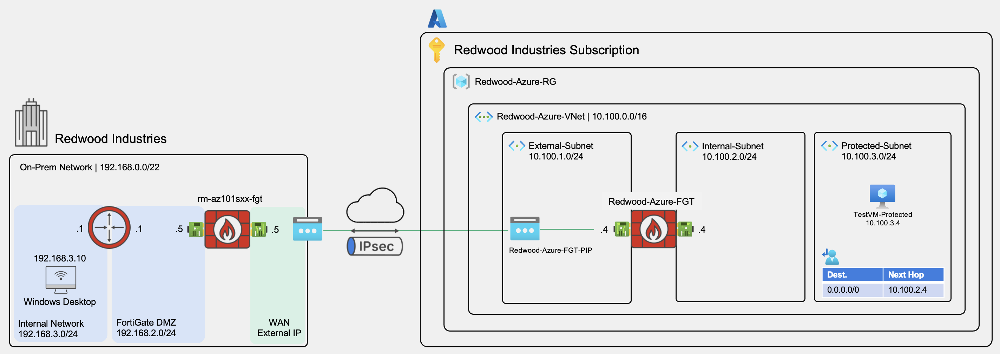

Secure Hybrid Connectivity Established ✓

---

## Pre-Lab: Gather VPN Parameters

Before configuring VPN, collect all necessary parameters. Write these down!

### Redwood Azure FortiGate

**From Labs 1-3:**

- **Public IP**: `Redwood-Azure-FGT-PIP` (Public IP)
- **Local Network**: `10.100.0.0/16`
- **VPN Interface**: port1 (External)
- **Internal Interface**: port2 (10.100.2.4)

### On-Premises FortiGate

**Provided by Instructor or Your Lab Environment:**

- **Public IP:** (write this down!)
- **Local Network:** `192.168.0.0/22` (On-premises network)
- **VPN Interface:** port1 (External)
- **Internal Interface:** port2 (192.168.2.4)

### VPN Configuration Parameters

**Pre-Shared Key (PSK):**

- **Workshop PSK:** `RedwoodIndustries2025!`
- ⚠️ **Critical:** Must match EXACTLY on both sides (case-sensitive)
- Write this down!

**Encryption Settings (IKE - Phase 1):**

- **IKE Version:** IKEv2
- **Authentication:** Pre-shared Key
- **Transport:** UDP
- **NAT Traversal:** Enabled
- **Keepalive Frequency:** 10 seconds

**VPN Wizard Will Configure:**

- **Encryption:** AES-256 (auto-configured)
- **Hash:** SHA-256 (auto-configured)
- **DH Group:** 14 (auto-configured)
- **Lifetime:** Default settings

### Configuration Summary Table

| Parameter | On-Prem FortiGate | Azure Hub FortiGate |
|-----------|-------------------|---------------------|
| **Public IP** | On-prem FGT public IP| `Redwood-Azure-FGT-PIP` |
| **Local Network** | 192.168.0.0/22 | 10.100.0.0/16 |
| **Remote Network** | 10.100.0.0/16 | 192.168.0.0/22 |
| **VPN Interface** | port1 (External) | port1 (External) |
| **Internal Interface** | port2 | port2 |
| **PSK** | RedwoodIndustries2025! | RedwoodIndustries2025! |
| **Tunnel Name** | to_azure | to_on_prem |

---

## Part A: Configure On-Premises FortiGate VPN

### Step 1: Access On-Premises FortiGate

We'll configure the VPN starting from the on-premises side.

#### 1.1 Log into On-Premises FortiGate

1. **Open Web Browser:**
   - Use Chrome or Firefox (recommended)

2. **Navigate to FortiGate:**
   - Enter in address bar: `https://<On-Prem-FortiGate-Public-IP>`
   - Example: `https://20.151.45.67`
   - Press Enter

3. **Certificate Warning (Expected):**
   - Click **Advanced** → **Proceed to [IP] (unsafe)**
   - This is normal - FortiGate uses self-signed certificate

4. **Login:**
   - **Username:** `fortinetuser`
   - **Password:** (The password you created during on-prem FortiGate deployment)
   - Click **Login**

### Validation

- ✅ Successfully logged into on-premises FortiGate
- ✅ Dashboard is visible
- ✅ On-prem Public IP recorded

---

### Step 2: Get Azure FortiGate Public IP (2 minutes)

Before creating the VPN, we need the Azure FortiGate's public IP address.

#### 2.1 Find Azure Hub FortiGate Public IP

1. **Navigate to Redwood-Azure-RG Resource Group:**
   - Azure Portal → Search for `Redwood-Azure-RG`
   - Click on the resource group

2. **Find Redwood Azure FortiGate Public IP:**
   - Look for resource **Redwood-Azure-FGT-PIP**
   - Click on it

3. **Copy IP Address:**
   - In the Overview page, copy the **IP address**
   - Example: `20.220.x.x` or `52.x.x.x`
   - ⚠️ **Write this down** - you'll use it as the remote gateway IP

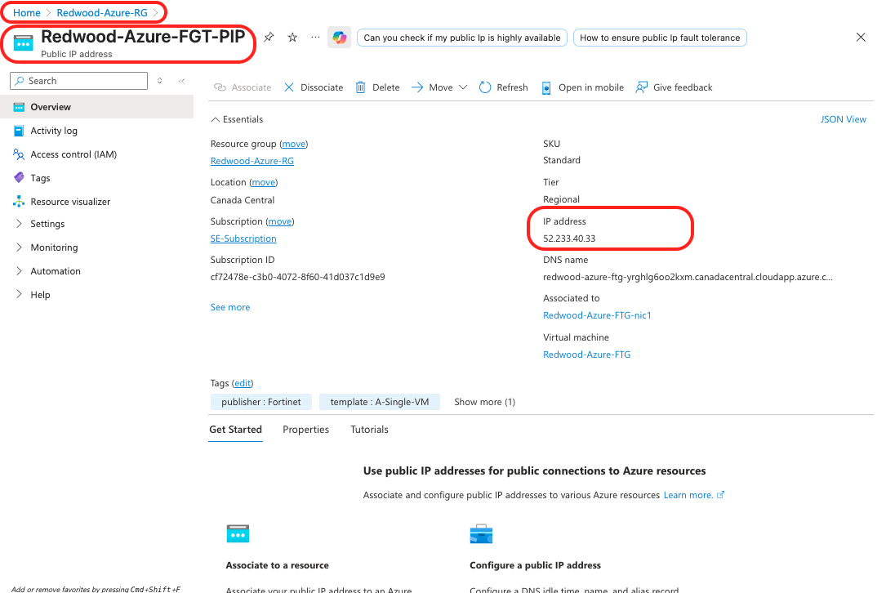

### Validation

- ✅ Redwood Azure FortiGate Public IP recorded
- ✅ You have both Public IPs ready (on-prem and Azure)

---

### Step 3: Create VPN on On-Premises FortiGate

Use FortiGate's VPN Wizard to simplify configuration. The wizard automatically creates the tunnel, policies, and routes.

#### 3.1 Start VPN Wizard

1. **Navigate to VPN Wizard:**
   - In on-premises FortiGate GUI, click **VPN** in left menu
   - Click **VPN Wizard**

2. **Configure VPN Setup:**
   - **Tunnel name:** Enter `to_azure`
   - **Template:** Select **Site to Site**
3. Click **"Begin"** button

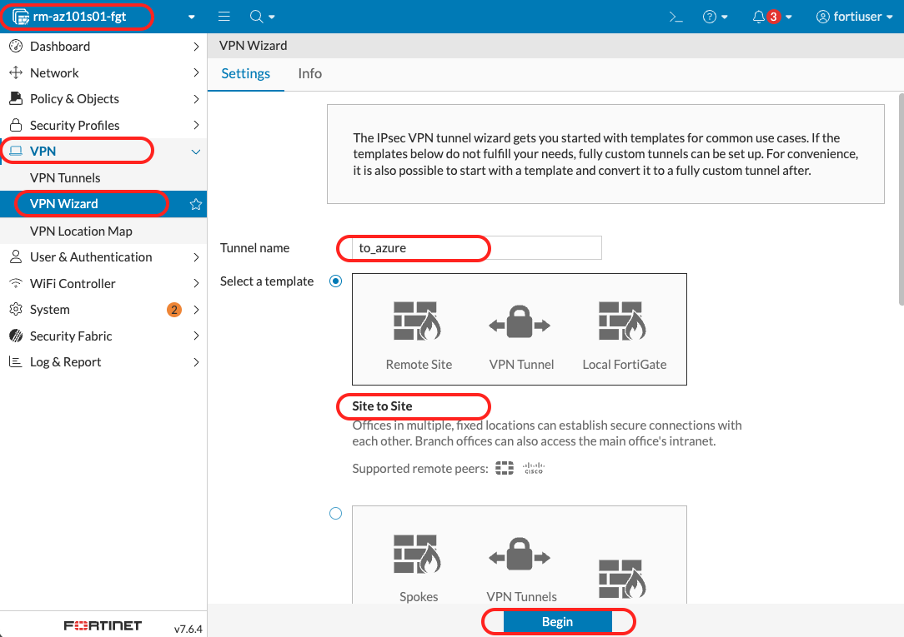

#### 3.2 Configure VPN Tunnel Settings

1. **VPN Tunnel Configuration:**
   - **Authentication Method:** Select **Pre-shared Key**
   - **Pre-shared Key:** Enter `RedwoodIndustries2025!`
     - ⚠️ Case-sensitive, no extra spaces
     - Copy/paste to avoid typos
   - **IKE Version:** Select **Version 2** (IKEv2)
   - **Transport:** Select **UDP**
   - **NAT traversal:** Check **Enable**
     - ⚠️ Important for Azure (Public IPs use NAT)
   - **Keepalive frequency:** Enter `10` seconds
2. Click **"Next"** button

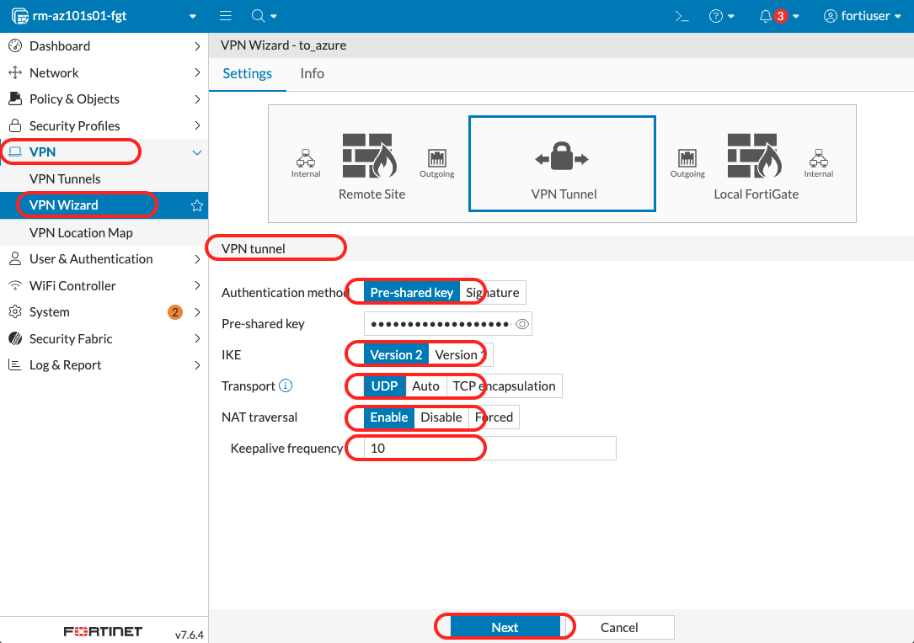

#### 3.3 Configure Remote Site (Azure)

1. **Remote Site Configuration:**
   - **Remote site device type:** Click the **FortiGate** logo
     - This optimizes settings for FortiGate-to-FortiGate VPN
   - **Remote site device:** Select **Accessible and static**
   - **IP address:** Enter **Azure FortiGate Public IP** (from Step 2.1)
     - Example: `20.220.137.45`
     - This is the Redwood-Azure-FGT-PIP IP you copied earlier
   - **Route this device's internet traffic through the remote site:** Select **Disable**
     - We don't want to route all on-prem internet through Azure
   - **Remote site subnets:** Enter `10.100.0.0/16`
     - This is the Azure Hub VNet range
2. Click **"Next"** button

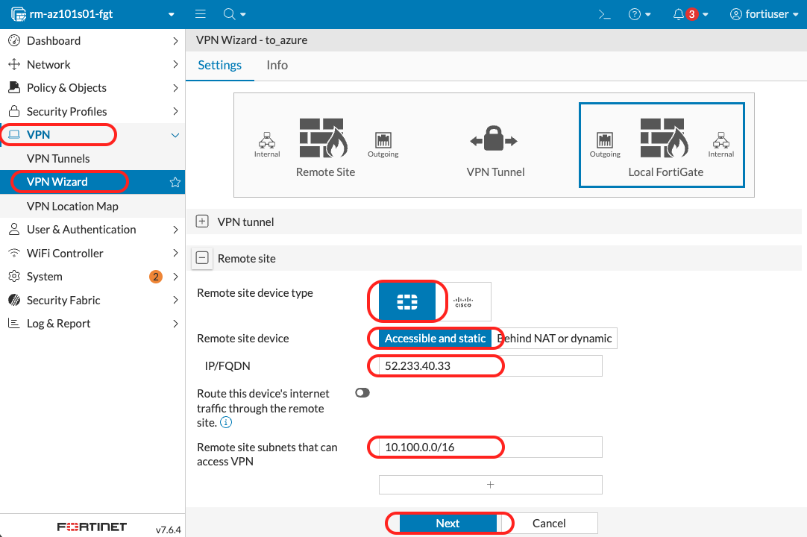

#### 3.4 Configure Local Site (On-Premises)

1. **Local Site Configuration:**

   **Outgoing Interface:**
   - **Outgoing interface:** Select **port1** (external interface)
   - **Create and add interface to zone:** Select **Disabled**
     - We don't need zones for this workshop

   **Local Interface:**
   - **Local Interface:** Select **port2** (internal interface)
   - **Local subnets:** Enter `192.168.0.0/22`
     - Should auto-populate based on port2 configuration
     - This is your on-premises network range

   **Internet Traffic:**
   - **Allow remote site's internet traffic:** Select **Disabled**
     - We don't want Azure traffic using on-prem internet breakout

2. Click **"Next"** button

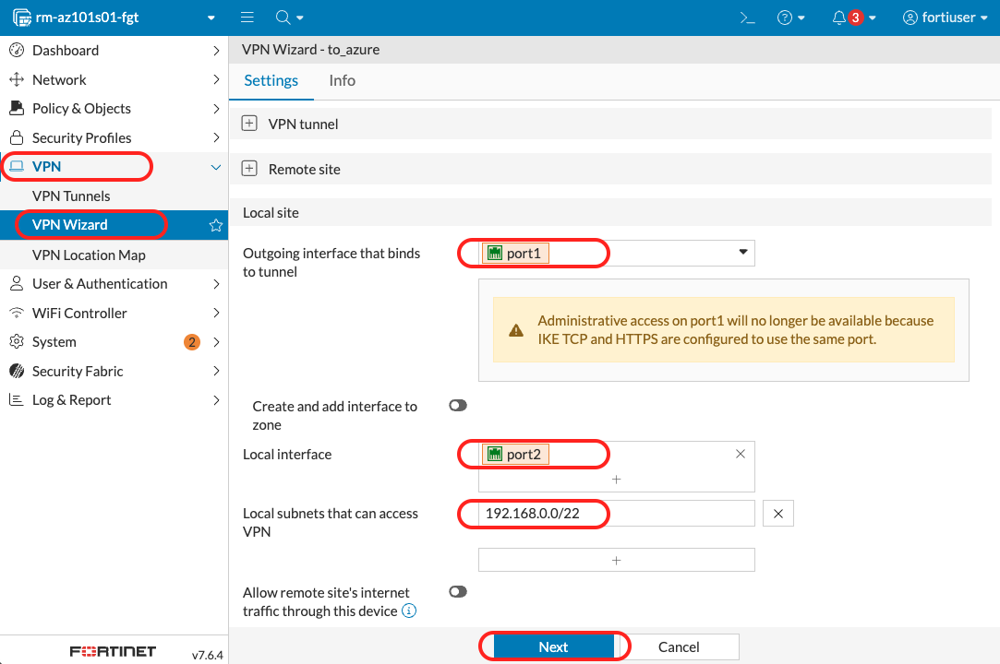

> [!WARNING]
> **Administrative Access Note:** If IKE and HTTPS both use port 443, administrative access through port1 may be impacted. Since this VPN uses UDP transport, no port conflicts should occur.

#### 3.5 Review and Submit

1. **Review Configuration:**
   - Verify all settings:
     - Tunnel name: to_azure
     - Remote IP: (hidden) Azure FortiGate Public IP
     - Remote subnets: 10.100.0.0/16
     - Local subnets: 192.168.0.0/22
     - PSK: (hidden) RedwoodIndustries2025!

2. **Submit:**
   - Click **"Submit"** button
   - Wait 10-15 seconds for wizard to complete

3. **What the Wizard Created:**
   - IPsec tunnel interface (to_azure)
   - Two firewall policies (inbound and outbound)
   - Static routes for remote subnets
   - Address objects for local and remote networks

### Validation

- ✅ VPN wizard completes successfully
- ✅ Tunnel "to_azure" created
- ✅ Status shows "down" (expected - Azure side not configured yet)

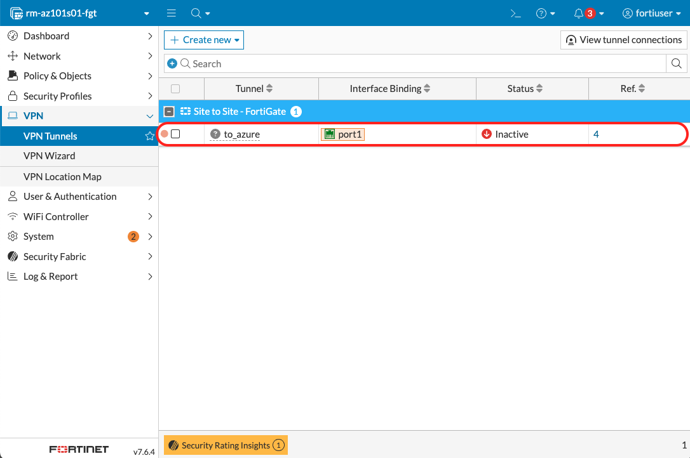

---

## Part B: Configure Azure FortiGate VPN

### Step 4: Access Redwood Azure FortiGate

#### 4.1 Log into Azure FortiGate

1. **Open Web Browser:**
   - Navigate to: `https://<Azure-FortiGate-Management-IP>`
   - Example: `https://20.220.138.75`

2. **Certificate Warning:**
   - Click **Advanced** → **Proceed to [IP]**

3. **Login:**
   - **Username:** `fortinetuser`
   - **Password:** (Same password as on-prem FortiGate)
   - Click **Login**

### Validation

- ✅ Successfully logged into Azure FortiGate
- ✅ Dashboard visible
- ✅ Ready to configure VPN

---

### Step 5: Create VPN on Azure FortiGate

Configure the matching VPN tunnel on the Azure side using the same wizard process.

#### 5.1 Start VPN Wizard

1. **Navigate to VPN Wizard:**
   - In Azure FortiGate GUI, click **VPN** in left menu
   - Click **VPN Wizard**

2. **Configure VPN Setup:**
   - **Tunnel name:** Enter `to_on_prem`
   - **Template:** Select **Site to Site**

3. Click **"Begin"** button

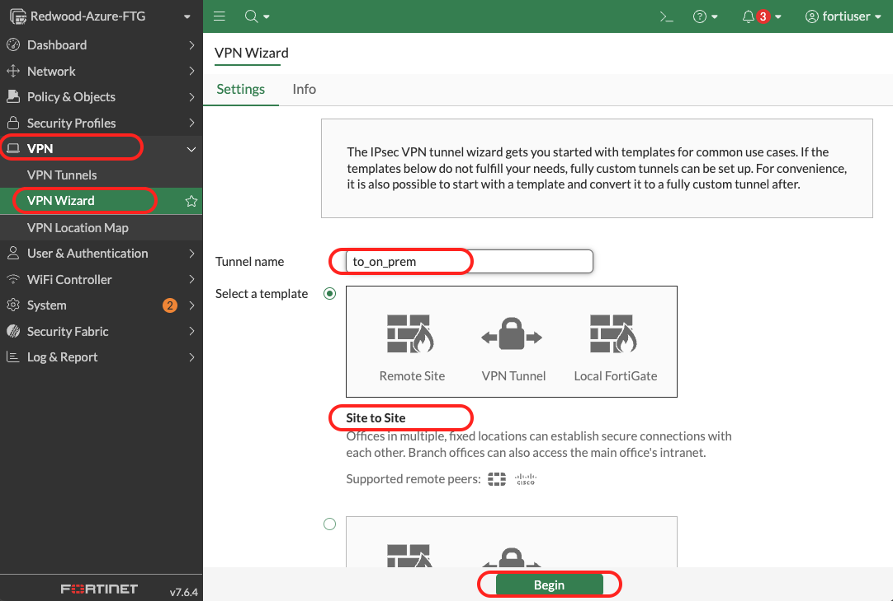

#### 5.2 Configure VPN Tunnel Settings

1. **VPN Tunnel Configuration:**
   - **Authentication Method:** Select **Pre-shared Key**
   - **Pre-shared Key:** Enter `RedwoodIndustries2025!`
     - ⚠️ **MUST match on-premises exactly!**
   - **IKE Version:** Select **Version 2**
   - **Transport:** Select **UDP**
   - **NAT traversal:** Check **Enable**
   - **Keepalive frequency:** Enter `10` seconds
2. Click **"Next"** button

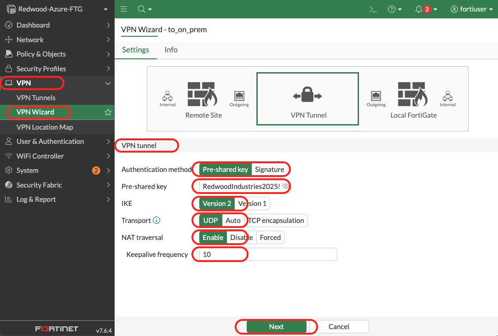

> [!IMPORTANT]
> **PSK Must Match:** The pre-shared key must be identical on both sides. `RedwoodIndustries2025!` is case-sensitive and must include the exclamation mark.

#### 5.3 Configure Remote Site (On-Premises)

1. **Remote Site Configuration:**
   - **Remote site device type:** Click the **FortiGate** logo
   - **Remote site device:** Select **Accessible and static**
   - **IP address:** Enter **On-Premises FortiGate Public IP** (from Step 1.1)
     - Example: `20.151.45.67`
     - This is the Public IP you copied earlier
   - **Route this device's internet traffic through the remote site:** Select **Disable**
   - **Remote site subnets:** Enter `192.168.0.0/22`
     - This is the on-premises network range
2. Click **"Next"** button

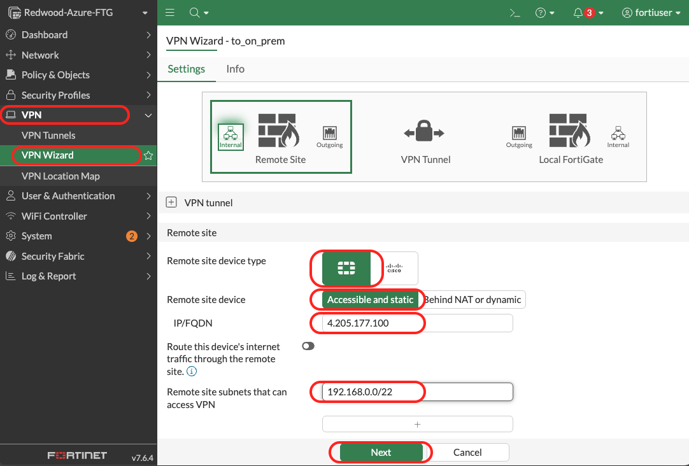

#### 5.4 Configure Local Site (Redwood Azure)

1. **Local Site Configuration:**

   **Outgoing Interface:**
   - **Outgoing interface:** Select **port1** (external interface)
   - **Create and add interface to zone:** Select **Disabled**

   **Local Interface:**
   - **Local Interface:** Select **port2** (internal interface)
   - **Local subnets:** Enter `10.100.0.0/16`
     - This is your `Redwood-Azure-VNet` VNet range
     - Should auto-populate based on port2

   **Internet Traffic:**
   - **Allow remote site's internet traffic:** Select **Disabled**

2. Click **"Next"** button

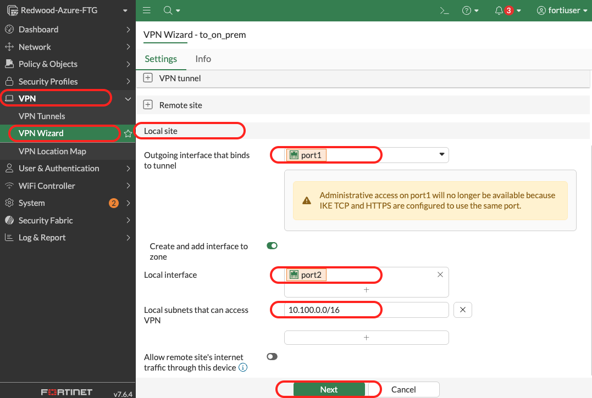

#### 5.5 Review and Submit

1. **Review Configuration:**
   - Verify all settings:
     - Tunnel name: to_on_prem
     - Remote IP: (hidden) On-Prem FortiGate Public IP
     - Remote subnets: 192.168.0.0/22
     - Local subnets: 10.100.0.0/16
     - PSK: (hidden) RedwoodIndustries2025!

2. **Submit:**
   - Click **"Submit"** button
   - Wait 10-15 seconds for wizard to complete

### Validation

- ✅ VPN wizard completes successfully
- ✅ Tunnel "to_on_prem" created
- ✅ Auto-created objects visible:
  - IPsec tunnel interface
  - Firewall policies (2)
  - Static routes
  - Address objects

### Critical Configuration Points

**Symmetric Configuration:**

- On-Prem side: Local = 192.168.0.0/22, Remote = 10.100.0.0/16
- Azure side: Local = 10.100.0.0/16, Remote = 192.168.0.0/22
- **Must mirror each other!**

**PSK Must Match:**

- If PSK different, Phase 1 will fail
- Case-sensitive: "Test" ≠ "test"
- No extra spaces allowed

**Public IPs Must Be Correct:**

- On-prem side points to `Redwood-Azure-FGT-PIP`
- Azure side points to Redwood On-prem FGT Public IP
- Typo = VPN won't connect

---

## Part C: Verify VPN Connectivity

### Step 6: Check VPN Tunnel Status

Verify the VPN tunnel established successfully between both FortiGates.

#### 6.1 Verify On-Premises Tunnel

1. **Check Dashboard:**
   - In on-premises FortiGate, navigate to **Dashboard** → **Network**
   - Locate the **IPsec** widget
   - Look for tunnel **to_azure**
   - **Status:** Should show **"Up"** with green indicator

   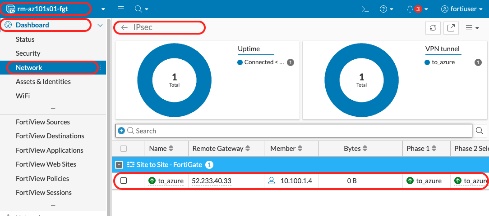

2. **Verify Tunnel Details:**
   - Click on tunnel name to see details
   - **Phase 1:** Should show "up"
   - **Phase 2:** Should show "up"
   - **Remote Gateway:** Should show Redwood Azure `Redwood-Azure-FGT-PIP`

**CLI Verification (Optional):**

```bash
diagnose vpn ike gateway list name to_azure
```

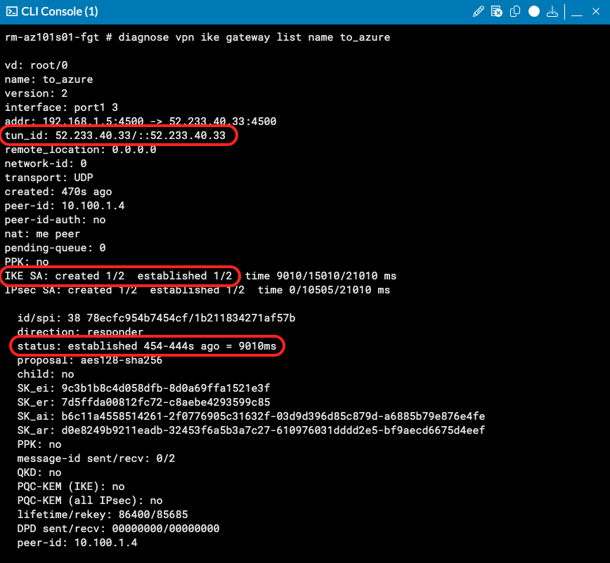

Expected output shows:

- Connection status: established
- IKE SA created
- tun_id: `Redwood-Azure-FGT-PIP`

#### 6.2 Verify Azure Tunnel

1. **Check Dashboard:**
   - In Azure FortiGate, navigate to **Dashboard** → **Network**
   - Locate the **IPsec** widget
   - Look for tunnel **to_on_prem**
   - **Status:** Should show **"Up"** with green indicator

   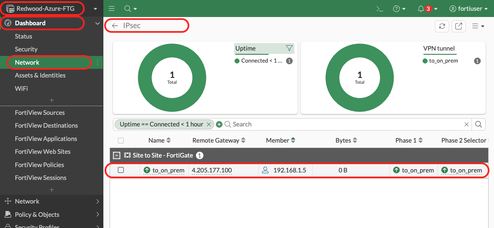

2. **Verify Tunnel Details:**
   - Click on tunnel name
   - **Phase 1:** Should show "up"
   - **Phase 2:** Should show "up"
   - **Remote Gateway:** Should show on-prem Public IP

**CLI Verification (Optional):**

```bash
diagnose vpn ike gateway list name to_on_prem
```

### Validation

- ✅ VPN tunnel status "up" on on-premises FortiGate (to_azure)
- ✅ VPN tunnel status "up" on Azure FortiGate (to_on_prem)
- ✅ Both Phase 1 and Phase 2 showing "up"
- ✅ No error messages in VPN Events logs

> [!TIP]
> **If tunnels show "Down":**
>
> - Wait 2-3 minutes for negotiation to complete
> - Check that public IPs are correct on both sides
> - Verify pre-shared keys match exactly (case-sensitive)
> - Ensure NAT traversal is enabled on both sides

---

### Step 7: Test Cross-Site Connectivity (7 minutes)

Test traffic flow through the VPN tunnel in both directions.

#### 7.1 Test On-Premises to Azure

We'll test connectivity from the on-premises Windows VM to the Azure hub.

1. **Connect to On-Prem VM:**
   - RDP to on-prem FortiGate public IP address on port 9833.
   - Use the authentication information provided by the instructor

2. **Open PowerShell:**
   - Once connected, click Start Menu
   - Type **PowerShell**
   - Click **Windows PowerShell**

3. **Test Connectivity to Azure:**

   ```powershell
   Test-NetConnection -ComputerName 10.100.3.4 -Port 22
   ```

   **Target:** 10.100.3.4 is TestVM-Protected in Azure

   **Expected Result:**

   ```powershell
   ComputerName     : 10.100.3.4
   RemoteAddress    : 10.100.3.4
   RemotePort       : 22
   InterfaceAlias   : Ethernet
   SourceAddress    : 192.168.3.10
   TcpTestSucceeded : True
   ```

### Validation

- ✅ Test-NetConnection succeeds (TcpTestSucceeded: True)
- ✅ Traffic traversing VPN tunnel

#### 7.2 Test Azure to On-Premises

Now test the reverse direction.

1. **Connect to Azure TestVM-Protected:**
   - Open the Azure Cloud Shell
   - SSH into the `TestVM-Protected`

2. **Test Connectivity to On-Prem:**

   ```bash
   nc -zv 192.168.3.10 3389
   ```

   **Target:** 192.168.3.10 is vm-on-prem-windows

   **Expected Result:**

   ```bash
   Connection to 192.168.3.10 3389 port [tcp/ms-wbt-server] succeeded!
   ```

### Validation

- ✅ ncat connection succeeds from Azure to on-prem
- ✅ Bidirectional connectivity confirmed
- ✅ VPN tunnel passing traffic both directions

### Troubleshooting Failed Connectivity

**If Connectivity Fails:**

**Check 1: VPN Tunnel Status:**

- Is tunnel "up" on both sides? (Step 6)
- If down, fix tunnel before testing traffic

**Check 2: Firewall Policies (On-Prem FortiGate):**

- Navigate to **Policy & Objects → Firewall Policy**
- Look for auto-created VPN policies
- Verify policies exist:
  - port2 → to_azure (outbound)
  - to_azure → port2 (inbound)
- Source: 192.168.0.0/22, Destination: 10.100.0.0/16
- Action: ACCEPT, Status: Enabled

**Check 3: Firewall Policies (Redwood-Azure-FTG):**

- Navigate to **Policy & Objects → Firewall Policy**
- Verify policies exist:
  - port2 → vpn_to_on_prem (outbound)
  - vpn_to_on_prem → port2 (inbound)
- Source: 10.100.0.0/16, Destination: 192.168.0.0/22
- Action: ACCEPT, Status: Enabled

**Check 4: Routing:**

- **On-Prem FortiGate**: Navigate to **Dashboard → Routing**
- Verify route to 10.100.0.0/16 via to_azure interface
- **Redwood-Azure-FTG FortiGate**: Navigate to **Dashboard → Routing**
- Verify route to 192.168.0.0/16 via to_on_prem interface

**Check 5: Use FortiGate Packet Capture:**

```bash
# On Redwood-Azure-FTG FortiGate CLI:
diagnose sniffer packet any "host 10.100.3.4 and host 192.168.3.10" 4 20
# Generate traffic from VM
# Watch for packets entering port2, encrypting, exiting via VPN
```

---

## Lab 4 Complete! 🎉

### What You've Accomplished

You have successfully established secure hybrid connectivity for Redwood Industries:

✅ **IPsec VPN configured** on on-premises FortiGate (to_azure)  
✅ **IPsec VPN configured** on Azure FortiGate (to_on_prem)  
✅ **VPN tunnel established** (Phase 1 & Phase 2 up)  
✅ **Firewall policies created** automatically by VPN wizard  
✅ **Bidirectional connectivity** tested and verified  
✅ **Hybrid network operational** - Azure workloads can securely communicate with on-premises  

### Complete Workshop Architecture

Final Redwood Industries Deployment:


Security: ✓ All traffic inspected by FortiGate
Connectivity: ✓ North-South (Internet) & Hybrid (VPN)
Visibility: ✓ Logs on both FortiGates
Compliance: ✓ Secure hybrid connectivity established

### Key Takeaways

1. **IPsec VPN Provides Secure Hybrid Connectivity:**
   - Encrypted tunnel between sites
   - No separate Azure VPN Gateway needed
   - FortiGate handles firewall + VPN in one platform

2. **Symmetric Configuration is Critical:**
   - Local/Remote subnets must mirror on both sides
   - PSK must match exactly
   - Public IPs must be correct

3. **Two Phases Must Be Up:**
   - Phase 1 (IKE): Control channel, authentication
   - Phase 2 (IPsec): Data encryption
   - Both required for traffic flow

4. **FortiGate VPN Wizard Simplifies Deployment:**
   - Auto-creates tunnel interface
   - Auto-creates firewall policies
   - Auto-configures routing (in most cases)
   - Reduces configuration errors

5. **NAT-T Important for Azure:**
   - Azure Public IPs use NAT
   - NAT-T encapsulates ESP in UDP 4500
   - Essential for VPN to work through Azure NAT

### Traffic Flow Recap

**Azure VM to On-Prem VM (Cross-Site Connectivity):**

1. TestVM-Protected VM (10.100.3.4) → Wants to reach Windows VM on-prem (192.168.3.10)
2. Azure routing → Sends to FortiGate port2 (10.100.2.4)
3. Azure FortiGate → Checks policy (VPN outbound policy matches)
4. Azure FortiGate → Encrypts traffic with IPsec
5. Azure FortiGate → Sends via VPN tunnel (to_on_prem) out port1
6. Internet → Encrypted packets traverse internet
7. On-prem FortiGate → Receives at port1, decrypts
8. On-prem FortiGate → Checks policy (VPN inbound policy matches)
9. On-prem FortiGate → Forwards to 192.168.3.10 via port2
10. Response follows reverse path

**Key Point:** Traffic is encrypted end-to-end between FortiGates, protecting data in transit over the internet. Both FortiGates inspect traffic before encryption (outbound) and after decryption (inbound).

---

## Workshop Complete! 🎉🎉🎉

### AZ-101 Full Achievement Unlocked

Over the past 3 hours, you've built a complete production-ready hybrid cloud security architecture:

**Lab 1:** Azure networking infrastructure (VNet, subnets, UDRs)  
**Lab 2:** FortiGate VM deployment and licensing  
**Lab 3:** Security policies and traffic inspection  
**Lab 4:** Site-to-site VPN for hybrid connectivity  

### Real-World Impact

You can now:

- ✅ **Deploy FortiGate in Azure** for customers
- ✅ **Configure security policies** for north-south traffic
- ✅ **Establish hybrid connectivity** with site-to-site VPN
- ✅ **Troubleshoot** common issues
- ✅ **Demonstrate business value** (cost savings, operational consistency)
- ✅ **Have confident conversations** with customers about FortiGate in Azure

### Customer Scenarios You Can Now Address

**Scenario FG-1: "We're a Fortinet customer"**
✓ You've shown how to extend on-prem FortiGate to Azure  
✓ Same management interface, same policies  
✓ Operational consistency achieved  

**Scenario FG-2: "We need to connect to on-premises"**
✓ You've established secure VPN tunnel  
✓ No separate Azure VPN Gateway needed  
✓ Single platform for firewall + VPN  

**Scenario FG-5: "Azure Firewall is too expensive"**
✓ You understand cost comparison ($9.7K vs $50K+ over 3 years)  
✓ You can articulate ROI and business case  
✓ Feature comparison mastered  

### Next Steps in Your Journey

**Immediate (This Week):**

- Practice labs again with your own Azure subscription
- Experiment with security profiles (IPS, Web Filtering)
- Deploy second Protected subnet, configure east-west inspection
- Share what you learned with your team

**Short-Term (Next Month):**

- Register for **AZ-102: Multi-VNet Hub-Spoke Architecture**
- Pursue **NSE 4 - FortiGate Security** certification
- Read Fortinet Azure documentation cover-to-cover

**Long-Term (6+ Months):**

- Complete full AZ-series (AZ-101 through AZ-106)
- Achieve NSE 4 and NSE 5 certifications
- Lead FortiGate Azure deployments independently
- Become FortiGate Azure subject matter expert for your organization

### Additional Resources

**Documentation:**

- Fortinet Azure Guide: <https://docs.fortinet.com/document/fortigate-public-cloud/7.6.0/azure-administration-guide/128029/about-fortigate-vm-for-azure>
- FortiGate VPN Guide: <https://docs.fortinet.com/document/fortigate/7.6.4/administration-guide/762500/general-ipsec-vpn-configuration>
- Azure Networking: <https://learn.microsoft.com/azure/virtual-network/>

**Community:**

- Fortinet Community: <https://community.fortinet.com>
- Reddit r/fortinet: Real-world Q&A
- LinkedIn Fortinet User Groups: Networking with peers

**Training:**

- Fortinet Training Institute: <https://training.fortinet.com>
- Free NSE 1-3 courses online
- Paid NSE 4+ with hands-on labs

### Thank You

Congratulations on completing **AZ-101: FortiGate as Azure Cloud Firewall!**

You've demonstrated dedication, technical aptitude, and commitment to mastering cloud security. The skills you've gained today will serve you and your customers well.

**Questions?** Contact your instructor.

**Feedback?** Please complete the workshop survey - your input helps us improve.

**See you in AZ-102!** Take care, keep learning, and secure those clouds! 🛡️☁️

---

## Troubleshooting Reference

### VPN Tunnel Won't Establish

**Phase 1 Failure:**

| Log Message | Cause | Solution |
|-------------|-------|----------|
| "no suitable proposal found" | IKE proposal mismatch | Verify encryption, hash, DH group match on both sides |
| "authentication failed" | Wrong PSK | Verify PSK is identical (case-sensitive) |
| "peer not responding" | Network connectivity issue | Verify Public IPs correct, NSG allows UDP 500/4500, both FortiGates can reach each other |
| "invalid ID information" | Local/remote subnet mismatch | Verify subnets configured correctly on both sides |

**Phase 2 Failure:**

| Log Message | Cause | Solution |
|-------------|-------|----------|
| "phase2 negotiation failed" | IPsec proposal mismatch | Verify Phase 2 encryption, hash, PFS settings match |
| "no selectors matched" | Encryption domain issue | Verify local/remote subnets exactly mirror each other |

**Check VPN Logs:**

- Log & Report → VPN Events
- Look for specific error messages
- Google the exact error for Fortinet KB articles

---

### VPN Tunnel Up But No Traffic

**Checklist:**

1. **Firewall Policies:**
   - [ ] Policy exists: port2 → VPN tunnel (Azure to on-prem)
   - [ ] Policy exists: VPN tunnel → port2 (on-prem to Azure)
   - [ ] Policies enabled (blue toggle)
   - [ ] Source/destination match actual traffic

2. **Routing (Azure FortiGate):**
   - [ ] Route to 192.168.3.0/24 via VPN tunnel interface
   - [ ] CLI: `get router info routing-table all | grep 192.168.0`

3. **Routing (On-Prem FortiGate):**
   - [ ] Route to 10.100.3.0/24 via VPN tunnel interface
   - [ ] CLI: `get router info routing-table all | grep 10.100.0`

4. **Azure UDR:**
   - [ ] RT-Protected has route: 0.0.0.0/0 → 10.100.2.4
   - [ ] RT-Protected associated with Protected-Subnet

5. **Test FortiGate-to-FortiGate First:**

   ```bash
   # Azure FortiGate CLI:
   execute ping-options source 10.100.2.4
   execute ping 192.168.2.5
   
   # If this works, issue is endpoint routing/policies, not VPN
   ```

6. **Packet Capture:**

   ```bash
   # Azure FortiGate CLI:
   diagnose sniffer packet any "host 10.100.3.4 and host 192.168.3.10" 4 20
   # Generate traffic from TestVM
   # Watch for packets entering port2, encrypting, exiting via VPN
   ```

---

### VPN Tunnel Flapping (Up/Down/Up/Down)

**Common Causes:**

1. **Network Instability:**
   - High packet loss or latency between sites
   - ISP issues
   - Solution: Test with continuous ping between Public IPs

2. **DPD Timeout Too Aggressive:**
   - Dead Peer Detection killing tunnel prematurely
   - Solution: Adjust DPD settings or disable temporarily

3. **NAT-T Issues:**
   - NAT-T not enabled on one or both sides
   - Solution: Ensure NAT-T enabled on both FortiGates

4. **Azure Maintenance:**
   - Azure performing VM maintenance
   - Solution: Check Azure Service Health, implement HA in production

5. **FortiGate CPU Overload:**
   - FortiGate CPU >90% can't maintain tunnel
   - Solution: Reduce load or upgrade VM size

---

## CLI Commands Reference

### VPN Status and Troubleshooting

```bash
# Show VPN tunnel status
diagnose vpn ike gateway list

# Show IPsec SAs (Security Associations)
diagnose vpn tunnel list

# Show VPN routing
get router info routing-table all | grep <VPN-interface-name>

# Bring tunnel up manually
diagnose vpn tunnel up <tunnel-name>

# Bring tunnel down
diagnose vpn tunnel down <tunnel-name>

# Clear VPN tunnel (reset)
diagnose vpn tunnel reset <tunnel-name>

# Debug VPN (Phase 1)
diagnose debug application ike -1
diagnose debug enable
# Generate VPN traffic or bring tunnel up
diagnose debug disable

# Debug VPN (Phase 2)
diagnose debug application ipsec -1
diagnose debug enable
# Generate VPN traffic
diagnose debug disable

# Show active IPsec sessions
diagnose sys session filter dst 192.168.3.10/24
diagnose sys session list

# Packet capture on VPN traffic
diagnose sniffer packet any "host 10.100.3.5 and host 192.168.3.10" 4 50
```

---

## **End of Lab 4 & AZ-101 Workshop**

*Estimated Lab 4 time: 40 minutes*  
*Total Workshop Time: 3 hours*

---

*Lab Guide Version 1.0 - November 2025*  
*Questions? Contact your instructor.*  
*Congratulations on completing AZ-101! 🎉*
